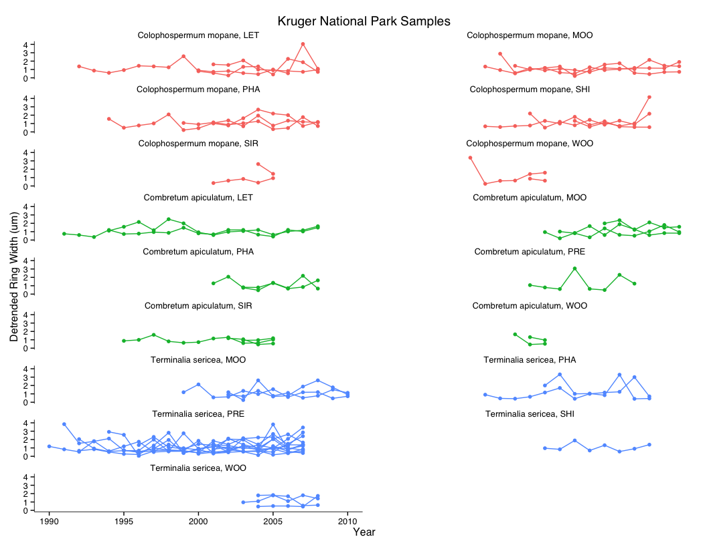
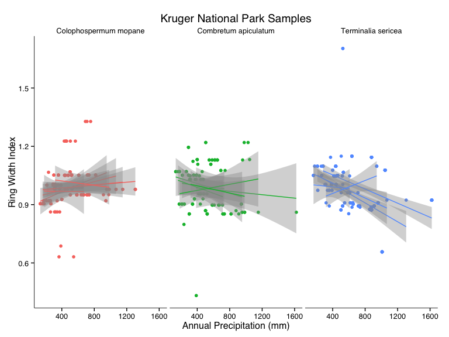
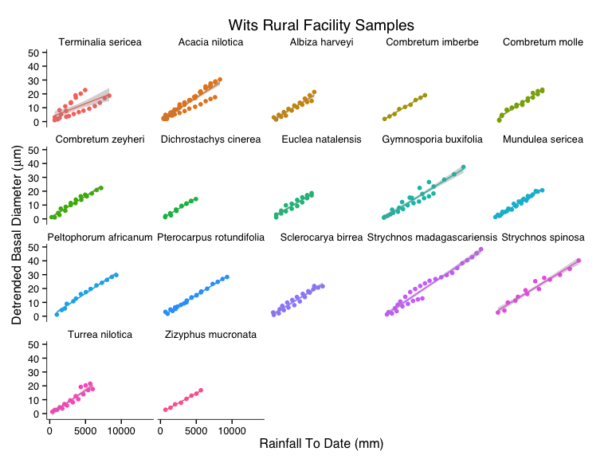
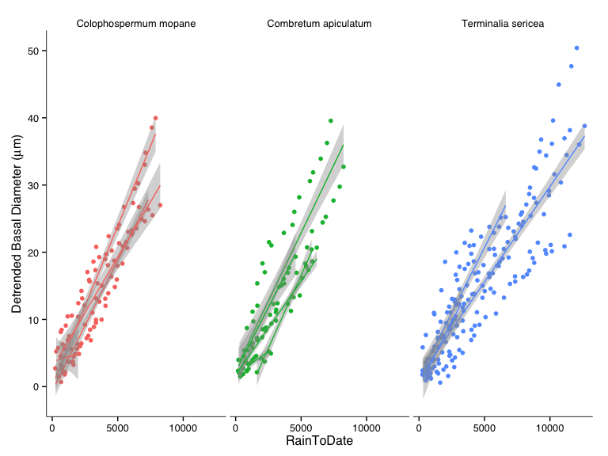

# Preliminary analysis of Tree Growth Data

Load appropriate libraries.

```r
library(plyr)
library(ggplot2)
library(stargazer)
library(ggthemes)
library(lme4)
library(extrafont)
```
Set working directory and establish standards for displaying figures.

```r
#setwd("/Users/danielgodwin/Dropbox/Graduate School/Dissertation/Chapter 3 - Growth/TreeRings/")

myTheme <- theme_tufte() +
  theme(
    text = element_text(family="Arial", size=12),
        axis.line = element_line(size = .3)
    )
```
Read in data.

```r
Melon_Sites <- read.csv("Sites/Mellon_Tree.csv")
Melon_Species <- read.csv("MeasuredGrowth/MellonGrant/MellonGrant_Species.csv")
Melon_Growth <- read.csv("MeasuredGrowth/MellonGrant/MellonGrant_TreeGrowth_LongForm.csv")
source("WeatherProcessor.R")
PRET2011_RINGW_LongForm <- read.csv("MeasuredGrowth/TrialProject/PRET2011_RINGW_LongForm.csv")

names(PRET2011_RINGW_LongForm) <- c("Sample","Year","RingWidth")

WRF_Rings <- read.csv("MeasuredGrowth/MellonGrant/WRF_TreeGrowth_LongForm.csv"
                      ,comment.char = "#",
                      skip = 1)
WRF_Rings$Year <- WRF_Rings$Year + 113
names(WRF_Rings)[1] <- "Sample"
names(WRF_Rings)[3] <- "RingWidth"
WRF_Rings$Site <- "WRF"

WRF_Species <- read.csv("MeasuredGrowth/MellonGrant/WRF_Species.csv",comment.char = "#",
                      skip = 1)


names(Melon_Sites)[2] <- "Sample"
names(Melon_Species) <- c("Sample","Species")

Melon_Master <- merge(Melon_Sites,Melon_Species, by="Sample")
Melon_Master$Species.x <- NULL
names(Melon_Master)[5] <- "Species"

WRF_Rings <- merge(WRF_Rings,WRF_Species,by="Sample")
#WRF_Rings$Species.x <- NULL
#names(Melon_Master)[5] <- "Species"
WRF_Rings <- na.omit(WRF_Rings)

names(Melon_Growth) <- c("Sample","Year","RingWidth")

Melon_Master <- merge(Melon_Master,Melon_Growth,by="Sample")
Melon_Master$Diam <- NULL
Melon_Master$TTT <- NULL

PRET2011_RINGW_LongForm$Site <- "PRE"
PRET2011_RINGW_LongForm$Species <-"Terminalia sericea"

Rings_Master <- rbind(Melon_Master,PRET2011_RINGW_LongForm)

Rings_Master <- rbind(Rings_Master,WRF_Rings)

Rings_Master$RingWith <- Rings_Master$RingWidth/1000

Rings_Master <- Rings_Master[order(Rings_Master$Sample,Rings_Master$Year),]

Rings_Master <- ddply(Rings_Master,.(Sample),mutate,Growth = cumsum(RingWith))

Rings_Master$EstCrossSection <- (Rings_Master$Growth)^2 * pi
Rings_Master$EstBasalDiameter <- (Rings_Master$Growth) * 2

Rings_Master <- ddply(Rings_Master,.(Sample),mutate,YearOfGrowth = Year - min(Year)+1)

Rings_Master_AllWx <- merge(Rings_Master,Kruger_Wx_Combined,by.x=c("Year","Site"),by.y=c("Year","Station"))

#MAP <- read.csv("Weather/Kruger_MAP.csv")
#Rings_Master_AllWx <- merge(Melon_AllWx,MAP,by.x="Site",by.y="Station")

Rings_Kruger <- subset(Rings_Master,Site != "WRF")
Rings_WRF <- subset(Rings_Master,Site == "WRF")
```

### Plot of Ring Width by Site

  

### Plot of Basal Diameter by Year

  

### Plot of Basal Diameter by Year of Growth

  

Detrending
========
* Fit linear model to each site, species
* Subtract predicted values from each object.


```r
blankDummyDF <- data.frame(Sample=factor(), Species = factor(), Site=factor(),YearOfGrowth=numeric(),RingWidth=numeric(),Year=numeric(),AnnualPrecip=numeric(),DetrendedRW=numeric())

for(k in unique(Rings_Master_AllWx$Species))
{
  SpeciesSubset <- subset(Rings_Master_AllWx,Species == k)
  for(l in unique(SpeciesSubset$Site)){
    SiteSubset <- subset(SpeciesSubset,Site == l)
    colsKeep <- c("Site","Year","Sample","Species","RingWidth","YearOfGrowth","AnnualPrecip")
    SiteSubset <- SiteSubset[colsKeep]
    
    print(paste(l," ",k))
    #detrendModel <- lm(RINGW ~ YearOfGrowth, data=SiteSubset)
    detrendModel <- glm(log(RingWidth) ~ YearOfGrowth,data=SiteSubset,family=gaussian(link="identity"))
    
   # hist(SiteSubset$RingWidth,main=paste(l," ",k))
    stargazer(detrendModel,type="text")
    
   # predictDF <- data.frame(YearOfGrowth = seq(1,20))
  #  predictDF$EstBasalDiameter <- predict(detrendModel,predictDF)
   # names(predictDF)[2] <- "PredBasalDiameter"
    
    SiteSubset$DetrendedRW <- log(SiteSubset$RingWidth) - predict(detrendModel)
    
    blankDummyDF <- rbind(blankDummyDF,SiteSubset)
  }
}
```

```
## [1] "PRE   Terminalia sericea"
## 
## =============================================
##                       Dependent variable:    
##                   ---------------------------
##                         log(RingWidth)       
## ---------------------------------------------
## YearOfGrowth                0.017*           
##                             (0.010)          
##                                              
## Constant                   5.286***          
##                             (0.098)          
##                                              
## ---------------------------------------------
## Observations                  179            
## Log Likelihood             -185.300          
## Akaike Inf. Crit.           374.500          
## =============================================
## Note:             *p<0.1; **p<0.05; ***p<0.01
## [1] "MOO   Terminalia sericea"
## 
## =============================================
##                       Dependent variable:    
##                   ---------------------------
##                         log(RingWidth)       
## ---------------------------------------------
## YearOfGrowth                 0.003           
##                             (0.032)          
##                                              
## Constant                   5.386***          
##                             (0.204)          
##                                              
## ---------------------------------------------
## Observations                  30             
## Log Likelihood              -23.740          
## Akaike Inf. Crit.           51.480           
## =============================================
## Note:             *p<0.1; **p<0.05; ***p<0.01
## [1] "WRF   Terminalia sericea"
## 
## =============================================
##                       Dependent variable:    
##                   ---------------------------
##                         log(RingWidth)       
## ---------------------------------------------
## YearOfGrowth                -0.006           
##                             (0.039)          
##                                              
## Constant                   5.383***          
##                             (0.247)          
##                                              
## ---------------------------------------------
## Observations                  25             
## Log Likelihood              -25.290          
## Akaike Inf. Crit.           54.570           
## =============================================
## Note:             *p<0.1; **p<0.05; ***p<0.01
## [1] "WOO   Terminalia sericea"
## 
## =============================================
##                       Dependent variable:    
##                   ---------------------------
##                         log(RingWidth)       
## ---------------------------------------------
## YearOfGrowth                -0.045           
##                             (0.094)          
##                                              
## Constant                   5.646***          
##                             (0.332)          
##                                              
## ---------------------------------------------
## Observations                  16             
## Log Likelihood              -13.960          
## Akaike Inf. Crit.           31.920           
## =============================================
## Note:             *p<0.1; **p<0.05; ***p<0.01
## [1] "LET   Combretum apiculatum"
## 
## =============================================
##                       Dependent variable:    
##                   ---------------------------
##                         log(RingWidth)       
## ---------------------------------------------
## YearOfGrowth                 0.011           
##                             (0.016)          
##                                              
## Constant                   5.279***          
##                             (0.160)          
##                                              
## ---------------------------------------------
## Observations                  33             
## Log Likelihood              -20.050          
## Akaike Inf. Crit.           44.100           
## =============================================
## Note:             *p<0.1; **p<0.05; ***p<0.01
## [1] "SIR   Combretum apiculatum"
## 
## =============================================
##                       Dependent variable:    
##                   ---------------------------
##                         log(RingWidth)       
## ---------------------------------------------
## YearOfGrowth                0.057**          
##                             (0.024)          
##                                              
## Constant                   4.850***          
##                             (0.163)          
##                                              
## ---------------------------------------------
## Observations                  27             
## Log Likelihood              -17.290          
## Akaike Inf. Crit.           38.580           
## =============================================
## Note:             *p<0.1; **p<0.05; ***p<0.01
## [1] "WOO   Combretum apiculatum"
## 
## =============================================
##                       Dependent variable:    
##                   ---------------------------
##                         log(RingWidth)       
## ---------------------------------------------
## YearOfGrowth                0.091**          
##                             (0.033)          
##                                              
## Constant                   4.933***          
##                             (0.185)          
##                                              
## ---------------------------------------------
## Observations                  26             
## Log Likelihood              -15.840          
## Akaike Inf. Crit.           35.670           
## =============================================
## Note:             *p<0.1; **p<0.05; ***p<0.01
## [1] "PRE   Combretum apiculatum"
## 
## =============================================
##                       Dependent variable:    
##                   ---------------------------
##                         log(RingWidth)       
## ---------------------------------------------
## YearOfGrowth                0.110*           
##                             (0.058)          
##                                              
## Constant                   4.798***          
##                             (0.392)          
##                                              
## ---------------------------------------------
## Observations                  11             
## Log Likelihood              -10.010          
## Akaike Inf. Crit.           24.010           
## =============================================
## Note:             *p<0.1; **p<0.05; ***p<0.01
## [1] "MOO   Combretum apiculatum"
## 
## =============================================
##                       Dependent variable:    
##                   ---------------------------
##                         log(RingWidth)       
## ---------------------------------------------
## YearOfGrowth                -0.058           
##                             (0.046)          
##                                              
## Constant                   5.777***          
##                             (0.252)          
##                                              
## ---------------------------------------------
## Observations                  25             
## Log Likelihood              -22.820          
## Akaike Inf. Crit.           49.640           
## =============================================
## Note:             *p<0.1; **p<0.05; ***p<0.01
## [1] "LET   Colophospermum mopane"
## 
## =============================================
##                       Dependent variable:    
##                   ---------------------------
##                         log(RingWidth)       
## ---------------------------------------------
## YearOfGrowth               0.082***          
##                             (0.022)          
##                                              
## Constant                   4.458***          
##                             (0.180)          
##                                              
## ---------------------------------------------
## Observations                  34             
## Log Likelihood              -28.850          
## Akaike Inf. Crit.           61.710           
## =============================================
## Note:             *p<0.1; **p<0.05; ***p<0.01
## [1] "WOO   Colophospermum mopane"
## 
## =============================================
##                       Dependent variable:    
##                   ---------------------------
##                         log(RingWidth)       
## ---------------------------------------------
## YearOfGrowth                0.037*           
##                             (0.020)          
##                                              
## Constant                   4.600***          
##                             (0.183)          
##                                              
## ---------------------------------------------
## Observations                  49             
## Log Likelihood              -44.440          
## Akaike Inf. Crit.           92.890           
## =============================================
## Note:             *p<0.1; **p<0.05; ***p<0.01
## [1] "MOO   Colophospermum mopane"
## 
## =============================================
##                       Dependent variable:    
##                   ---------------------------
##                         log(RingWidth)       
## ---------------------------------------------
## YearOfGrowth               0.092***          
##                             (0.020)          
##                                              
## Constant                   4.284***          
##                             (0.161)          
##                                              
## ---------------------------------------------
## Observations                  39             
## Log Likelihood              -26.320          
## Akaike Inf. Crit.           56.650           
## =============================================
## Note:             *p<0.1; **p<0.05; ***p<0.01
## [1] "SIR   Colophospermum mopane"
## 
## =============================================
##                       Dependent variable:    
##                   ---------------------------
##                         log(RingWidth)       
## ---------------------------------------------
## YearOfGrowth                -0.107           
##                             (0.096)          
##                                              
## Constant                   5.734***          
##                             (0.429)          
##                                              
## ---------------------------------------------
## Observations                  13             
## Log Likelihood              -14.420          
## Akaike Inf. Crit.           32.840           
## =============================================
## Note:             *p<0.1; **p<0.05; ***p<0.01
## [1] "WRF   Peltophorum africanum"
## 
## =============================================
##                       Dependent variable:    
##                   ---------------------------
##                         log(RingWidth)       
## ---------------------------------------------
## YearOfGrowth                 0.041           
##                             (0.025)          
##                                              
## Constant                   4.939***          
##                             (0.212)          
##                                              
## ---------------------------------------------
## Observations                  14             
## Log Likelihood              -6.078           
## Akaike Inf. Crit.           16.160           
## =============================================
## Note:             *p<0.1; **p<0.05; ***p<0.01
## [1] "WRF   Pterocarpus rotundifolia"
## 
## =============================================
##                       Dependent variable:    
##                   ---------------------------
##                         log(RingWidth)       
## ---------------------------------------------
## YearOfGrowth                -0.009           
##                             (0.015)          
##                                              
## Constant                   5.466***          
##                             (0.111)          
##                                              
## ---------------------------------------------
## Observations                  22             
## Log Likelihood              -1.951           
## Akaike Inf. Crit.            7.901           
## =============================================
## Note:             *p<0.1; **p<0.05; ***p<0.01
## [1] "WRF   Acacia nilotica"
## 
## =============================================
##                       Dependent variable:    
##                   ---------------------------
##                         log(RingWidth)       
## ---------------------------------------------
## YearOfGrowth                0.038**          
##                             (0.017)          
##                                              
## Constant                   5.164***          
##                             (0.125)          
##                                              
## ---------------------------------------------
## Observations                  47             
## Log Likelihood              -24.480          
## Akaike Inf. Crit.           52.950           
## =============================================
## Note:             *p<0.1; **p<0.05; ***p<0.01
## [1] "WRF   Sclerocarya birrea"
## 
## =============================================
##                       Dependent variable:    
##                   ---------------------------
##                         log(RingWidth)       
## ---------------------------------------------
## YearOfGrowth                 0.007           
##                             (0.033)          
##                                              
## Constant                   5.171***          
##                             (0.206)          
##                                              
## ---------------------------------------------
## Observations                  20             
## Log Likelihood              -11.610          
## Akaike Inf. Crit.           27.220           
## =============================================
## Note:             *p<0.1; **p<0.05; ***p<0.01
## [1] "WRF   Combretum zeyheri"
## 
## =============================================
##                       Dependent variable:    
##                   ---------------------------
##                         log(RingWidth)       
## ---------------------------------------------
## YearOfGrowth                 0.028           
##                             (0.037)          
##                                              
## Constant                   5.176***          
##                             (0.221)          
##                                              
## ---------------------------------------------
## Observations                  18             
## Log Likelihood              -11.510          
## Akaike Inf. Crit.           27.010           
## =============================================
## Note:             *p<0.1; **p<0.05; ***p<0.01
## [1] "WRF   Combretum molle"
## 
## =============================================
##                       Dependent variable:    
##                   ---------------------------
##                         log(RingWidth)       
## ---------------------------------------------
## YearOfGrowth                 0.002           
##                             (0.041)          
##                                              
## Constant                   5.204***          
##                             (0.254)          
##                                              
## ---------------------------------------------
## Observations                  20             
## Log Likelihood              -15.480          
## Akaike Inf. Crit.           34.970           
## =============================================
## Note:             *p<0.1; **p<0.05; ***p<0.01
## [1] "WRF   Strychnos madagascariensis"
## 
## =============================================
##                       Dependent variable:    
##                   ---------------------------
##                         log(RingWidth)       
## ---------------------------------------------
## YearOfGrowth                0.061*           
##                             (0.032)          
##                                              
## Constant                   5.578***          
##                             (0.190)          
##                                              
## ---------------------------------------------
## Observations                  28             
## Log Likelihood              -18.550          
## Akaike Inf. Crit.           41.100           
## =============================================
## Note:             *p<0.1; **p<0.05; ***p<0.01
## [1] "WRF   Mundulea sericea"
## 
## =============================================
##                       Dependent variable:    
##                   ---------------------------
##                         log(RingWidth)       
## ---------------------------------------------
## YearOfGrowth                -0.062*          
##                             (0.031)          
##                                              
## Constant                   5.578***          
##                             (0.172)          
##                                              
## ---------------------------------------------
## Observations                  26             
## Log Likelihood              -13.940          
## Akaike Inf. Crit.           31.870           
## =============================================
## Note:             *p<0.1; **p<0.05; ***p<0.01
## [1] "WRF   Combretum imberbe"
## 
## =============================================
##                       Dependent variable:    
##                   ---------------------------
##                         log(RingWidth)       
## ---------------------------------------------
## YearOfGrowth                 0.054           
##                             (0.046)          
##                                              
## Constant                   4.978***          
##                             (0.257)          
##                                              
## ---------------------------------------------
## Observations                   9             
## Log Likelihood              -3.300           
## Akaike Inf. Crit.           10.600           
## =============================================
## Note:             *p<0.1; **p<0.05; ***p<0.01
## [1] "WRF   Albiza harveyi"
## 
## =============================================
##                       Dependent variable:    
##                   ---------------------------
##                         log(RingWidth)       
## ---------------------------------------------
## YearOfGrowth                0.089**          
##                             (0.040)          
##                                              
## Constant                   4.968***          
##                             (0.216)          
##                                              
## ---------------------------------------------
## Observations                  17             
## Log Likelihood              -8.829           
## Akaike Inf. Crit.           21.660           
## =============================================
## Note:             *p<0.1; **p<0.05; ***p<0.01
## [1] "WRF   Strychnos spinosa"
## 
## =============================================
##                       Dependent variable:    
##                   ---------------------------
##                         log(RingWidth)       
## ---------------------------------------------
## YearOfGrowth                -0.032           
##                             (0.051)          
##                                              
## Constant                   5.531***          
##                             (0.249)          
##                                              
## ---------------------------------------------
## Observations                  14             
## Log Likelihood              -8.919           
## Akaike Inf. Crit.           21.840           
## =============================================
## Note:             *p<0.1; **p<0.05; ***p<0.01
## [1] "WRF   Gymnosporia buxifolia"
## 
## =============================================
##                       Dependent variable:    
##                   ---------------------------
##                         log(RingWidth)       
## ---------------------------------------------
## YearOfGrowth                -0.032           
##                             (0.051)          
##                                              
## Constant                   5.531***          
##                             (0.249)          
##                                              
## ---------------------------------------------
## Observations                  14             
## Log Likelihood              -8.919           
## Akaike Inf. Crit.           21.840           
## =============================================
## Note:             *p<0.1; **p<0.05; ***p<0.01
## [1] "WRF   Zizyphus mucronata"
## 
## =============================================
##                       Dependent variable:    
##                   ---------------------------
##                         log(RingWidth)       
## ---------------------------------------------
## YearOfGrowth                 0.028           
##                             (0.059)          
##                                              
## Constant                   5.348***          
##                             (0.298)          
##                                              
## ---------------------------------------------
## Observations                   8             
## Log Likelihood              -3.523           
## Akaike Inf. Crit.           11.050           
## =============================================
## Note:             *p<0.1; **p<0.05; ***p<0.01
## [1] "WRF   Euclea natalensis"
## 
## =============================================
##                       Dependent variable:    
##                   ---------------------------
##                         log(RingWidth)       
## ---------------------------------------------
## YearOfGrowth                 0.021           
##                             (0.054)          
##                                              
## Constant                   4.989***          
##                             (0.272)          
##                                              
## ---------------------------------------------
## Observations                  16             
## Log Likelihood              -11.350          
## Akaike Inf. Crit.           26.690           
## =============================================
## Note:             *p<0.1; **p<0.05; ***p<0.01
## [1] "WRF   Turrea nilotica"
## 
## =============================================
##                       Dependent variable:    
##                   ---------------------------
##                         log(RingWidth)       
## ---------------------------------------------
## YearOfGrowth                 0.102           
##                             (0.096)          
##                                              
## Constant                   5.142***          
##                             (0.488)          
##                                              
## ---------------------------------------------
## Observations                   7             
## Log Likelihood              -6.445           
## Akaike Inf. Crit.           16.890           
## =============================================
## Note:             *p<0.1; **p<0.05; ***p<0.01
## [1] "WRF   Dichrostachys cinerea"
## 
## =============================================
##                       Dependent variable:    
##                   ---------------------------
##                         log(RingWidth)       
## ---------------------------------------------
## YearOfGrowth                -0.023           
##                             (0.050)          
##                                              
## Constant                   5.752***          
##                             (0.209)          
##                                              
## ---------------------------------------------
## Observations                  13             
## Log Likelihood              -4.240           
## Akaike Inf. Crit.           12.480           
## =============================================
## Note:             *p<0.1; **p<0.05; ***p<0.01
```

```r
detrendedDF <- blankDummyDF

#detrendedDF <- merge(detrendedDF,MAP,by.x="Site",by.y="Station")
detrendedDF$DetrendedRW <- exp(detrendedDF$DetrendedRW)

detrendedDF <- detrendedDF[order(detrendedDF$Sample,detrendedDF$YearOfGrowth),]
detrendedDF <- ddply(detrendedDF,.(Sample),mutate,EstBasalDiameter = 2*cumsum(DetrendedRW))
detrendedDF <- ddply(detrendedDF,.(Sample),mutate,RainToDate = cumsum(AnnualPrecip))

detrendedDF[mapply(is.infinite, detrendedDF)] <- NA
detrendedDF <- na.omit(detrendedDF)

detrendedDF <- ddply(detrendedDF,.(Sample),mutate,meanLifeRainfall = mean(AnnualPrecip,na.rm=TRUE),sumLifeRainfall = sum(AnnualPrecip,na.rm=TRUE))

detrendedDF_Kruger <- subset(detrendedDF,Site != "WRF")
detrendedDF_WRF <- subset(detrendedDF,Site == "WRF")
 

rm(blankDummyDF)
#rm(SiteSubset)
rm(detrendModel)
rm(SpeciesSubset)
```

### Detrended Growth by Species and Site


  


  

### Relationship Between Annual Rainfall and Detrended Growth

  

### Relationship Between Annual Rainfall and Detrended Basal Diameter

  

### Relationship Between Rainfall-To-Date and Detrended Basal Diameter

  


### Correlations


```
## 
## Correlation by Sites
## ===============
##   Site siteCorr
## ---------------
## 1 LET   0.210  
## 2 MOO   0.323  
## 3 PRE   0.142  
## 4 SIR   0.185  
## 5 WOO   0.376  
## 6 WRF   0.205  
## ---------------
```

```
## 
## Correlation by Species
## ======================================
##             Species           siteCorr
## --------------------------------------
## 1    Colophospermum mopane     0.326  
## 2     Combretum apiculatum     0.233  
## 3      Terminalia sericea      0.126  
## 4       Acacia nilotica        0.321  
## 5        Albiza harveyi        0.469  
## 6      Combretum imberbe       0.345  
## 7       Combretum molle        -0.079 
## 8      Combretum zeyheri       0.186  
## 9    Dichrostachys cinerea     -0.129 
## 10     Euclea natalensis       -0.052 
## 11   Gymnosporia buxifolia     0.042  
## 12      Mundulea sericea       -0.241 
## 13   Peltophorum africanum     0.342  
## 14  Pterocarpus rotundifolia   0.027  
## 15     Sclerocarya birrea      0.220  
## 16 Strychnos madagascariensis  0.279  
## 17     Strychnos spinosa       0.042  
## 18      Turrea nilotica        0.336  
## 19     Zizyphus mucronata      0.201  
## --------------------------------------
```

```
## 
## Correlation by Species & Site
## ===========================================
##    Site          Species           siteCorr
## -------------------------------------------
## 1  LET    Colophospermum mopane     0.313  
## 2  LET     Combretum apiculatum     0.179  
## 3  MOO    Colophospermum mopane     0.635  
## 4  MOO     Combretum apiculatum     0.030  
## 5  MOO      Terminalia sericea      0.027  
## 6  PRE     Combretum apiculatum     0.482  
## 7  PRE      Terminalia sericea      0.132  
## 8  SIR    Colophospermum mopane     0.364  
## 9  SIR     Combretum apiculatum     -0.011 
## 10 WOO    Colophospermum mopane     0.009  
## 11 WOO     Combretum apiculatum     -0.614 
## 12 WOO      Terminalia sericea      -0.121 
## 13 WRF      Terminalia sericea      0.605  
## 14 WRF       Acacia nilotica        0.321  
## 15 WRF        Albiza harveyi        0.469  
## 16 WRF      Combretum imberbe       0.345  
## 17 WRF       Combretum molle        -0.079 
## 18 WRF      Combretum zeyheri       0.186  
## 19 WRF    Dichrostachys cinerea     -0.129 
## 20 WRF      Euclea natalensis       -0.052 
## 21 WRF    Gymnosporia buxifolia     0.042  
## 22 WRF       Mundulea sericea       -0.241 
## 23 WRF    Peltophorum africanum     0.342  
## 24 WRF   Pterocarpus rotundifolia   0.027  
## 25 WRF      Sclerocarya birrea      0.220  
## 26 WRF  Strychnos madagascariensis  0.279  
## 27 WRF      Strychnos spinosa       0.042  
## 28 WRF       Turrea nilotica        0.336  
## 29 WRF      Zizyphus mucronata      0.201  
## -------------------------------------------
```

Growth Models
========
First, we subset the data.

```r
COMO_sub <- subset(Rings_Master_AllWx,Species == "Colophospermum mopane")
COAP_sub <- subset(Rings_Master_AllWx,Species == "Combretum apiculatum")
TESE_sub <- subset(Rings_Master_AllWx,Species == "Terminalia sericea")
```
TESE Models

```r
teseLM <- glm(EstBasalDiameter ~ YearOfGrowth,data=TESE_sub,family=Gamma(link="log"))
teseLM_poly <- glm(EstBasalDiameter ~ poly(YearOfGrowth,3),data=TESE_sub,family=Gamma(link="log"))
teseLMannual <- glm(EstBasalDiameter ~ AnnualPrecip,data=TESE_sub,family=Gamma(link="log"))
teseLMwx <- glm(EstBasalDiameter ~ YearOfGrowth * AnnualPrecip,data=TESE_sub,family=Gamma(link="log"))
```
COAP Models

```r
coapGLM <- glm(EstBasalDiameter ~ YearOfGrowth,data=COAP_sub,family=Gamma(link="log"))
coapLM_poly <- glm(EstBasalDiameter ~ poly(YearOfGrowth,3),data=COAP_sub,family=Gamma(link="log"))
coapLMannual <- glm(EstBasalDiameter ~ AnnualPrecip,data=COAP_sub,family=Gamma(link="log"))
coapLMwx <- glm(EstBasalDiameter ~ YearOfGrowth * AnnualPrecip,data=COAP_sub,family=Gamma(link="log"))
```
COMO Models

```r
comoGLM <- glm(EstBasalDiameter ~ 0 + YearOfGrowth,data=COMO_sub,family=Gamma(link="log"))
comoLM_poly <- glm(EstBasalDiameter ~ poly(YearOfGrowth,3),data=COMO_sub,family=Gamma(link="log"))
comoLMannual <- glm(EstBasalDiameter ~ AnnualPrecip,data=COMO_sub,family=Gamma(link="log"))
comoLMwx <- glm(EstBasalDiameter ~ YearOfGrowth * AnnualPrecip,data=COMO_sub,family=Gamma(link="log"))
```

Naive Growth

```r
naive_growth <- ddply(Rings_Master_AllWx,
                      .(Species,Site,Sample),
                      summarize,
                      TotalSize = sum(EstBasalDiameter),
                      Age = max(YearOfGrowth),
                      meanLifeRainfall = mean(AnnualPrecip,na.rm=TRUE),
                      sumLifeRainfall = sum(AnnualPrecip,na.rm=TRUE)
                      )

naive_growth$NaiveRate <- naive_growth$TotalSize/naive_growth$Age


for(i in unique(naive_growth$Species))
  {
tree_model_meanLife <- lm(log(TotalSize) ~ 0 + Age + meanLifeRainfall,data=subset(naive_growth,Species==i))
tree_model_sumLife <- lm(log(TotalSize) ~ 0 + Age + sumLifeRainfall,data=subset(naive_growth,Species==i))
tree_model_norain <- lm(log(TotalSize) ~ 0 + Age,data=subset(naive_growth,Species==i))

print(i)                 
print(summary(tree_model_meanLife))
print(summary(tree_model_sumLife))
print(summary(tree_model_norain))
print(anova(tree_model_norain,tree_model_meanLife))
print(anova(tree_model_norain,tree_model_sumLife))


}
```

```
## [1] "Colophospermum mopane"
## 
## Call:
## lm(formula = log(TotalSize) ~ 0 + Age + meanLifeRainfall, data = subset(naive_growth, 
##     Species == i))
## 
## Residuals:
##     Min      1Q  Median      3Q     Max 
## -0.3400 -0.2932 -0.0504  0.0609  1.1703 
## 
## Coefficients:
##                  Estimate Std. Error t value Pr(>|t|)   
## Age               0.18641    0.05120    3.64   0.0054 **
## meanLifeRainfall  0.00185    0.00118    1.57   0.1516   
## ---
## Signif. codes:  0 '***' 0.001 '**' 0.01 '*' 0.05 '.' 0.1 ' ' 1
## 
## Residual standard error: 0.493 on 9 degrees of freedom
## Multiple R-squared:  0.98,	Adjusted R-squared:  0.976 
## F-statistic:  222 on 2 and 9 DF,  p-value: 2.19e-08
## 
## 
## Call:
## lm(formula = log(TotalSize) ~ 0 + Age + sumLifeRainfall, data = subset(naive_growth, 
##     Species == i))
## 
## Residuals:
##     Min      1Q  Median      3Q     Max 
## -0.4847 -0.1864  0.0635  0.2274  1.3880 
## 
## Coefficients:
##                 Estimate Std. Error t value Pr(>|t|)    
## Age             2.62e-01   4.75e-02    5.51  0.00038 ***
## sumLifeRainfall 4.29e-06   8.02e-05    0.05  0.95848    
## ---
## Signif. codes:  0 '***' 0.001 '**' 0.01 '*' 0.05 '.' 0.1 ' ' 1
## 
## Residual standard error: 0.556 on 9 degrees of freedom
## Multiple R-squared:  0.975,	Adjusted R-squared:  0.969 
## F-statistic:  174 on 2 and 9 DF,  p-value: 6.48e-08
## 
## 
## Call:
## lm(formula = log(TotalSize) ~ 0 + Age, data = subset(naive_growth, 
##     Species == i))
## 
## Residuals:
##     Min      1Q  Median      3Q     Max 
## -0.4921 -0.1873  0.0631  0.2199  1.3786 
## 
## Coefficients:
##     Estimate Std. Error t value Pr(>|t|)    
## Age   0.2642     0.0135    19.6  2.6e-09 ***
## ---
## Signif. codes:  0 '***' 0.001 '**' 0.01 '*' 0.05 '.' 0.1 ' ' 1
## 
## Residual standard error: 0.528 on 10 degrees of freedom
## Multiple R-squared:  0.975,	Adjusted R-squared:  0.972 
## F-statistic:  386 on 1 and 10 DF,  p-value: 2.57e-09
## 
## Analysis of Variance Table
## 
## Model 1: log(TotalSize) ~ 0 + Age
## Model 2: log(TotalSize) ~ 0 + Age + meanLifeRainfall
##   Res.Df  RSS Df Sum of Sq    F Pr(>F)
## 1     10 2.78                         
## 2      9 2.19  1     0.597 2.45   0.15
## Analysis of Variance Table
## 
## Model 1: log(TotalSize) ~ 0 + Age
## Model 2: log(TotalSize) ~ 0 + Age + sumLifeRainfall
##   Res.Df  RSS Df Sum of Sq  F Pr(>F)
## 1     10 2.78                       
## 2      9 2.78  1  0.000886  0   0.96
## [1] "Combretum apiculatum"
## 
## Call:
## lm(formula = log(TotalSize) ~ 0 + Age + meanLifeRainfall, data = subset(naive_growth, 
##     Species == i))
## 
## Residuals:
##     Min      1Q  Median      3Q     Max 
## -0.4108 -0.2628 -0.0071  0.3115  0.9565 
## 
## Coefficients:
##                  Estimate Std. Error t value Pr(>|t|)    
## Age              0.176721   0.032156    5.50  0.00026 ***
## meanLifeRainfall 0.002537   0.000666    3.81  0.00344 ** 
## ---
## Signif. codes:  0 '***' 0.001 '**' 0.01 '*' 0.05 '.' 0.1 ' ' 1
## 
## Residual standard error: 0.423 on 10 degrees of freedom
## Multiple R-squared:  0.985,	Adjusted R-squared:  0.983 
## F-statistic:  338 on 2 and 10 DF,  p-value: 6.57e-10
## 
## 
## Call:
## lm(formula = log(TotalSize) ~ 0 + Age + sumLifeRainfall, data = subset(naive_growth, 
##     Species == i))
## 
## Residuals:
##     Min      1Q  Median      3Q     Max 
## -1.1314  0.0159  0.3075  0.4072  1.3525 
## 
## Coefficients:
##                 Estimate Std. Error t value Pr(>|t|)   
## Age             2.85e-01   8.27e-02    3.44   0.0063 **
## sumLifeRainfall 1.43e-05   1.70e-04    0.08   0.9347   
## ---
## Signif. codes:  0 '***' 0.001 '**' 0.01 '*' 0.05 '.' 0.1 ' ' 1
## 
## Residual standard error: 0.663 on 10 degrees of freedom
## Multiple R-squared:  0.964,	Adjusted R-squared:  0.957 
## F-statistic:  135 on 2 and 10 DF,  p-value: 5.78e-08
## 
## 
## Call:
## lm(formula = log(TotalSize) ~ 0 + Age, data = subset(naive_growth, 
##     Species == i))
## 
## Residuals:
##     Min      1Q  Median      3Q     Max 
## -1.1361 -0.0054  0.3239  0.4043  1.3482 
## 
## Coefficients:
##     Estimate Std. Error t value Pr(>|t|)    
## Age   0.2913     0.0169    17.2  2.6e-09 ***
## ---
## Signif. codes:  0 '***' 0.001 '**' 0.01 '*' 0.05 '.' 0.1 ' ' 1
## 
## Residual standard error: 0.632 on 11 degrees of freedom
## Multiple R-squared:  0.964,	Adjusted R-squared:  0.961 
## F-statistic:  297 on 1 and 11 DF,  p-value: 2.62e-09
## 
## Analysis of Variance Table
## 
## Model 1: log(TotalSize) ~ 0 + Age
## Model 2: log(TotalSize) ~ 0 + Age + meanLifeRainfall
##   Res.Df  RSS Df Sum of Sq    F Pr(>F)   
## 1     11 4.39                            
## 2     10 1.79  1       2.6 14.5 0.0034 **
## ---
## Signif. codes:  0 '***' 0.001 '**' 0.01 '*' 0.05 '.' 0.1 ' ' 1
## Analysis of Variance Table
## 
## Model 1: log(TotalSize) ~ 0 + Age
## Model 2: log(TotalSize) ~ 0 + Age + sumLifeRainfall
##   Res.Df  RSS Df Sum of Sq    F Pr(>F)
## 1     11 4.39                         
## 2     10 4.39  1    0.0031 0.01   0.93
## [1] "Terminalia sericea"
## 
## Call:
## lm(formula = log(TotalSize) ~ 0 + Age + meanLifeRainfall, data = subset(naive_growth, 
##     Species == i))
## 
## Residuals:
##     Min      1Q  Median      3Q     Max 
## -0.7411 -0.2203 -0.0109  0.3032  0.6828 
## 
## Coefficients:
##                  Estimate Std. Error t value Pr(>|t|)    
## Age              0.146182   0.019601    7.46  4.7e-07 ***
## meanLifeRainfall 0.002520   0.000371    6.79  1.7e-06 ***
## ---
## Signif. codes:  0 '***' 0.001 '**' 0.01 '*' 0.05 '.' 0.1 ' ' 1
## 
## Residual standard error: 0.405 on 19 degrees of freedom
## Multiple R-squared:  0.988,	Adjusted R-squared:  0.987 
## F-statistic:  813 on 2 and 19 DF,  p-value: <2e-16
## 
## 
## Call:
## lm(formula = log(TotalSize) ~ 0 + Age + sumLifeRainfall, data = subset(naive_growth, 
##     Species == i))
## 
## Residuals:
##     Min      1Q  Median      3Q     Max 
## -0.8796 -0.1793  0.0685  0.5955  1.1973 
## 
## Coefficients:
##                  Estimate Std. Error t value Pr(>|t|)    
## Age              0.536211   0.105728    5.07  6.8e-05 ***
## sumLifeRainfall -0.000390   0.000154   -2.52    0.021 *  
## ---
## Signif. codes:  0 '***' 0.001 '**' 0.01 '*' 0.05 '.' 0.1 ' ' 1
## 
## Residual standard error: 0.65 on 19 degrees of freedom
## Multiple R-squared:  0.97,	Adjusted R-squared:  0.967 
## F-statistic:  310 on 2 and 19 DF,  p-value: 3.09e-15
## 
## 
## Call:
## lm(formula = log(TotalSize) ~ 0 + Age, data = subset(naive_growth, 
##     Species == i))
## 
## Residuals:
##    Min     1Q Median     3Q    Max 
## -0.997 -0.415  0.424  0.791  1.181 
## 
## Coefficients:
##     Estimate Std. Error t value Pr(>|t|)    
## Age   0.2710     0.0123      22  1.7e-15 ***
## ---
## Signif. codes:  0 '***' 0.001 '**' 0.01 '*' 0.05 '.' 0.1 ' ' 1
## 
## Residual standard error: 0.732 on 20 degrees of freedom
## Multiple R-squared:  0.96,	Adjusted R-squared:  0.958 
## F-statistic:  485 on 1 and 20 DF,  p-value: 1.71e-15
## 
## Analysis of Variance Table
## 
## Model 1: log(TotalSize) ~ 0 + Age
## Model 2: log(TotalSize) ~ 0 + Age + meanLifeRainfall
##   Res.Df   RSS Df Sum of Sq    F  Pr(>F)    
## 1     20 10.71                              
## 2     19  3.12  1      7.59 46.1 1.7e-06 ***
## ---
## Signif. codes:  0 '***' 0.001 '**' 0.01 '*' 0.05 '.' 0.1 ' ' 1
## Analysis of Variance Table
## 
## Model 1: log(TotalSize) ~ 0 + Age
## Model 2: log(TotalSize) ~ 0 + Age + sumLifeRainfall
##   Res.Df   RSS Df Sum of Sq    F Pr(>F)  
## 1     20 10.71                           
## 2     19  8.02  1      2.69 6.36  0.021 *
## ---
## Signif. codes:  0 '***' 0.001 '**' 0.01 '*' 0.05 '.' 0.1 ' ' 1
## [1] "Acacia nilotica"
## 
## Call:
## lm(formula = log(TotalSize) ~ 0 + Age + meanLifeRainfall, data = subset(naive_growth, 
##     Species == i))
## 
## Residuals:
##      45      46      47      48 
## -0.3531  0.1588  0.1413  0.0477 
## 
## Coefficients:
##                  Estimate Std. Error t value Pr(>|t|)
## Age               0.14947    0.09822    1.52     0.27
## meanLifeRainfall  0.00268    0.00178    1.50     0.27
## 
## Residual standard error: 0.293 on 2 degrees of freedom
## Multiple R-squared:  0.996,	Adjusted R-squared:  0.993 
## F-statistic:  285 on 2 and 2 DF,  p-value: 0.0035
## 
## 
## Call:
## lm(formula = log(TotalSize) ~ 0 + Age + sumLifeRainfall, data = subset(naive_growth, 
##     Species == i))
## 
## Residuals:
##       45       46       47       48 
## -0.27706  0.05938  0.21730 -0.00547 
## 
## Coefficients:
##                  Estimate Std. Error t value Pr(>|t|)
## Age             -0.330967   0.324007   -1.02     0.41
## sumLifeRainfall  0.000969   0.000501    1.94     0.19
## 
## Residual standard error: 0.253 on 2 degrees of freedom
## Multiple R-squared:  0.997,	Adjusted R-squared:  0.995 
## F-statistic:  384 on 2 and 2 DF,  p-value: 0.0026
## 
## 
## Call:
## lm(formula = log(TotalSize) ~ 0 + Age, data = subset(naive_growth, 
##     Species == i))
## 
## Residuals:
##      45      46      47      48 
## -0.4103 -0.0341  0.0841  0.4358 
## 
## Coefficients:
##     Estimate Std. Error t value Pr(>|t|)    
## Age   0.2959     0.0148      20  0.00027 ***
## ---
## Signif. codes:  0 '***' 0.001 '**' 0.01 '*' 0.05 '.' 0.1 ' ' 1
## 
## Residual standard error: 0.35 on 3 degrees of freedom
## Multiple R-squared:  0.993,	Adjusted R-squared:  0.99 
## F-statistic:  399 on 1 and 3 DF,  p-value: 0.000274
## 
## Analysis of Variance Table
## 
## Model 1: log(TotalSize) ~ 0 + Age
## Model 2: log(TotalSize) ~ 0 + Age + meanLifeRainfall
##   Res.Df   RSS Df Sum of Sq    F Pr(>F)
## 1      3 0.367                         
## 2      2 0.172  1     0.194 2.26   0.27
## Analysis of Variance Table
## 
## Model 1: log(TotalSize) ~ 0 + Age
## Model 2: log(TotalSize) ~ 0 + Age + sumLifeRainfall
##   Res.Df   RSS Df Sum of Sq    F Pr(>F)
## 1      3 0.367                         
## 2      2 0.128  1     0.239 3.75   0.19
## [1] "Albiza harveyi"
## 
## Call:
## lm(formula = log(TotalSize) ~ 0 + Age + meanLifeRainfall, data = subset(naive_growth, 
##     Species == i))
## 
## Residuals:
## ALL 2 residuals are 0: no residual degrees of freedom!
## 
## Coefficients:
##                  Estimate Std. Error t value Pr(>|t|)
## Age               0.41604         NA      NA       NA
## meanLifeRainfall -0.00101         NA      NA       NA
## 
## Residual standard error: NaN on 0 degrees of freedom
## Multiple R-squared:     1,	Adjusted R-squared:   NaN 
## F-statistic:  NaN on 2 and 0 DF,  p-value: NA
## 
## 
## Call:
## lm(formula = log(TotalSize) ~ 0 + Age + sumLifeRainfall, data = subset(naive_growth, 
##     Species == i))
## 
## Residuals:
## ALL 2 residuals are 0: no residual degrees of freedom!
## 
## Coefficients:
##                  Estimate Std. Error t value Pr(>|t|)
## Age              0.590712         NA      NA       NA
## sumLifeRainfall -0.000374         NA      NA       NA
## 
## Residual standard error: NaN on 0 degrees of freedom
## Multiple R-squared:     1,	Adjusted R-squared:   NaN 
## F-statistic:  NaN on 2 and 0 DF,  p-value: NA
## 
## 
## Call:
## lm(formula = log(TotalSize) ~ 0 + Age, data = subset(naive_growth, 
##     Species == i))
## 
## Residuals:
##      49      50 
## -0.0632  0.0562 
## 
## Coefficients:
##     Estimate Std. Error t value Pr(>|t|)  
## Age  0.33482    0.00703    47.6    0.013 *
## ---
## Signif. codes:  0 '***' 0.001 '**' 0.01 '*' 0.05 '.' 0.1 ' ' 1
## 
## Residual standard error: 0.0846 on 1 degrees of freedom
## Multiple R-squared:     1,	Adjusted R-squared:  0.999 
## F-statistic: 2.27e+03 on 1 and 1 DF,  p-value: 0.0134
## 
## Analysis of Variance Table
## 
## Model 1: log(TotalSize) ~ 0 + Age
## Model 2: log(TotalSize) ~ 0 + Age + meanLifeRainfall
##   Res.Df     RSS Df Sum of Sq F Pr(>F)
## 1      1 0.00716                      
## 2      0 0.00000  1   0.00716         
## Analysis of Variance Table
## 
## Model 1: log(TotalSize) ~ 0 + Age
## Model 2: log(TotalSize) ~ 0 + Age + sumLifeRainfall
##   Res.Df     RSS Df Sum of Sq F Pr(>F)
## 1      1 0.00716                      
## 2      0 0.00000  1   0.00716         
## [1] "Combretum imberbe"
## 
## Call:
## lm(formula = log(TotalSize) ~ 0 + Age + meanLifeRainfall, data = subset(naive_growth, 
##     Species == i))
## 
## Residuals:
## ALL 1 residuals are 0: no residual degrees of freedom!
## 
## Coefficients: (1 not defined because of singularities)
##                  Estimate Std. Error t value Pr(>|t|)
## Age                 0.315         NA      NA       NA
## meanLifeRainfall       NA         NA      NA       NA
## 
## Residual standard error: NaN on 0 degrees of freedom
## Multiple R-squared:     1,	Adjusted R-squared:   NaN 
## F-statistic:  NaN on 1 and 0 DF,  p-value: NA
## 
## 
## Call:
## lm(formula = log(TotalSize) ~ 0 + Age + sumLifeRainfall, data = subset(naive_growth, 
##     Species == i))
## 
## Residuals:
## ALL 1 residuals are 0: no residual degrees of freedom!
## 
## Coefficients: (1 not defined because of singularities)
##                 Estimate Std. Error t value Pr(>|t|)
## Age                0.315         NA      NA       NA
## sumLifeRainfall       NA         NA      NA       NA
## 
## Residual standard error: NaN on 0 degrees of freedom
## Multiple R-squared:     1,	Adjusted R-squared:   NaN 
## F-statistic:  NaN on 1 and 0 DF,  p-value: NA
## 
## 
## Call:
## lm(formula = log(TotalSize) ~ 0 + Age, data = subset(naive_growth, 
##     Species == i))
## 
## Residuals:
## ALL 1 residuals are 0: no residual degrees of freedom!
## 
## Coefficients:
##     Estimate Std. Error t value Pr(>|t|)
## Age    0.315         NA      NA       NA
## 
## Residual standard error: NaN on 0 degrees of freedom
## Multiple R-squared:     1,	Adjusted R-squared:   NaN 
## F-statistic:  NaN on 1 and 0 DF,  p-value: NA
## 
## Analysis of Variance Table
## 
## Model 1: log(TotalSize) ~ 0 + Age
## Model 2: log(TotalSize) ~ 0 + Age + meanLifeRainfall
##   Res.Df RSS Df Sum of Sq F Pr(>F)
## 1      0   0                      
## 2      0   0  0         0         
## Analysis of Variance Table
## 
## Model 1: log(TotalSize) ~ 0 + Age
## Model 2: log(TotalSize) ~ 0 + Age + sumLifeRainfall
##   Res.Df RSS Df Sum of Sq F Pr(>F)
## 1      0   0                      
## 2      0   0  0         0         
## [1] "Combretum molle"
## 
## Call:
## lm(formula = log(TotalSize) ~ 0 + Age + meanLifeRainfall, data = subset(naive_growth, 
##     Species == i))
## 
## Residuals:
##      52      53 
## -0.0508  0.0508 
## 
## Coefficients: (1 not defined because of singularities)
##                  Estimate Std. Error t value Pr(>|t|)  
## Age               0.31457    0.00508    61.9     0.01 *
## meanLifeRainfall       NA         NA      NA       NA  
## ---
## Signif. codes:  0 '***' 0.001 '**' 0.01 '*' 0.05 '.' 0.1 ' ' 1
## 
## Residual standard error: 0.0719 on 1 degrees of freedom
## Multiple R-squared:     1,	Adjusted R-squared:  0.999 
## F-statistic: 3.83e+03 on 1 and 1 DF,  p-value: 0.0103
## 
## 
## Call:
## lm(formula = log(TotalSize) ~ 0 + Age + sumLifeRainfall, data = subset(naive_growth, 
##     Species == i))
## 
## Residuals:
##      52      53 
## -0.0508  0.0508 
## 
## Coefficients: (1 not defined because of singularities)
##                 Estimate Std. Error t value Pr(>|t|)  
## Age              0.31457    0.00508    61.9     0.01 *
## sumLifeRainfall       NA         NA      NA       NA  
## ---
## Signif. codes:  0 '***' 0.001 '**' 0.01 '*' 0.05 '.' 0.1 ' ' 1
## 
## Residual standard error: 0.0719 on 1 degrees of freedom
## Multiple R-squared:     1,	Adjusted R-squared:  0.999 
## F-statistic: 3.83e+03 on 1 and 1 DF,  p-value: 0.0103
## 
## 
## Call:
## lm(formula = log(TotalSize) ~ 0 + Age, data = subset(naive_growth, 
##     Species == i))
## 
## Residuals:
##      52      53 
## -0.0508  0.0508 
## 
## Coefficients:
##     Estimate Std. Error t value Pr(>|t|)  
## Age  0.31457    0.00508    61.9     0.01 *
## ---
## Signif. codes:  0 '***' 0.001 '**' 0.01 '*' 0.05 '.' 0.1 ' ' 1
## 
## Residual standard error: 0.0719 on 1 degrees of freedom
## Multiple R-squared:     1,	Adjusted R-squared:  0.999 
## F-statistic: 3.83e+03 on 1 and 1 DF,  p-value: 0.0103
## 
## Analysis of Variance Table
## 
## Model 1: log(TotalSize) ~ 0 + Age
## Model 2: log(TotalSize) ~ 0 + Age + meanLifeRainfall
##   Res.Df     RSS Df Sum of Sq F Pr(>F)
## 1      1 0.00517                      
## 2      1 0.00517  0         0         
## Analysis of Variance Table
## 
## Model 1: log(TotalSize) ~ 0 + Age
## Model 2: log(TotalSize) ~ 0 + Age + sumLifeRainfall
##   Res.Df     RSS Df Sum of Sq F Pr(>F)
## 1      1 0.00517                      
## 2      1 0.00517  0         0         
## [1] "Combretum zeyheri"
## 
## Call:
## lm(formula = log(TotalSize) ~ 0 + Age + meanLifeRainfall, data = subset(naive_growth, 
##     Species == i))
## 
## Residuals:
## ALL 2 residuals are 0: no residual degrees of freedom!
## 
## Coefficients:
##                  Estimate Std. Error t value Pr(>|t|)
## Age               0.19712         NA      NA       NA
## meanLifeRainfall  0.00172         NA      NA       NA
## 
## Residual standard error: NaN on 0 degrees of freedom
## Multiple R-squared:     1,	Adjusted R-squared:   NaN 
## F-statistic:  NaN on 2 and 0 DF,  p-value: NA
## 
## 
## Call:
## lm(formula = log(TotalSize) ~ 0 + Age + sumLifeRainfall, data = subset(naive_growth, 
##     Species == i))
## 
## Residuals:
## ALL 2 residuals are 0: no residual degrees of freedom!
## 
## Coefficients:
##                 Estimate Std. Error t value Pr(>|t|)
## Age             -0.56674         NA      NA       NA
## sumLifeRainfall  0.00132         NA      NA       NA
## 
## Residual standard error: NaN on 0 degrees of freedom
## Multiple R-squared:     1,	Adjusted R-squared:   NaN 
## F-statistic:  NaN on 2 and 0 DF,  p-value: NA
## 
## 
## Call:
## lm(formula = log(TotalSize) ~ 0 + Age, data = subset(naive_growth, 
##     Species == i))
## 
## Residuals:
##     54     55 
##  0.358 -0.228 
## 
## Coefficients:
##     Estimate Std. Error t value Pr(>|t|)  
## Age   0.3201     0.0325    9.85    0.064 .
## ---
## Signif. codes:  0 '***' 0.001 '**' 0.01 '*' 0.05 '.' 0.1 ' ' 1
## 
## Residual standard error: 0.424 on 1 degrees of freedom
## Multiple R-squared:  0.99,	Adjusted R-squared:  0.98 
## F-statistic: 96.9 on 1 and 1 DF,  p-value: 0.0644
## 
## Analysis of Variance Table
## 
## Model 1: log(TotalSize) ~ 0 + Age
## Model 2: log(TotalSize) ~ 0 + Age + meanLifeRainfall
##   Res.Df  RSS Df Sum of Sq F Pr(>F)
## 1      1 0.18                      
## 2      0 0.00  1      0.18         
## Analysis of Variance Table
## 
## Model 1: log(TotalSize) ~ 0 + Age
## Model 2: log(TotalSize) ~ 0 + Age + sumLifeRainfall
##   Res.Df  RSS Df Sum of Sq F Pr(>F)
## 1      1 0.18                      
## 2      0 0.00  1      0.18         
## [1] "Dichrostachys cinerea"
## 
## Call:
## lm(formula = log(TotalSize) ~ 0 + Age + meanLifeRainfall, data = subset(naive_growth, 
##     Species == i))
## 
## Residuals:
## ALL 2 residuals are 0: no residual degrees of freedom!
## 
## Coefficients:
##                  Estimate Std. Error t value Pr(>|t|)
## Age              0.350979         NA      NA       NA
## meanLifeRainfall 0.000596         NA      NA       NA
## 
## Residual standard error: NaN on 0 degrees of freedom
## Multiple R-squared:     1,	Adjusted R-squared:   NaN 
## F-statistic:  NaN on 2 and 0 DF,  p-value: NA
## 
## 
## Call:
## lm(formula = log(TotalSize) ~ 0 + Age + sumLifeRainfall, data = subset(naive_growth, 
##     Species == i))
## 
## Residuals:
## ALL 2 residuals are 0: no residual degrees of freedom!
## 
## Coefficients:
##                 Estimate Std. Error t value Pr(>|t|)
## Age              -8.2003         NA      NA       NA
## sumLifeRainfall   0.0122         NA      NA       NA
## 
## Residual standard error: NaN on 0 degrees of freedom
## Multiple R-squared:     1,	Adjusted R-squared:   NaN 
## F-statistic:  NaN on 2 and 0 DF,  p-value: NA
## 
## 
## Call:
## lm(formula = log(TotalSize) ~ 0 + Age, data = subset(naive_growth, 
##     Species == i))
## 
## Residuals:
##      56      57 
##  0.0351 -0.0301 
## 
## Coefficients:
##     Estimate Std. Error t value Pr(>|t|)   
## Age  0.41559    0.00501      83   0.0077 **
## ---
## Signif. codes:  0 '***' 0.001 '**' 0.01 '*' 0.05 '.' 0.1 ' ' 1
## 
## Residual standard error: 0.0462 on 1 degrees of freedom
## Multiple R-squared:     1,	Adjusted R-squared:     1 
## F-statistic: 6.89e+03 on 1 and 1 DF,  p-value: 0.00767
## 
## Analysis of Variance Table
## 
## Model 1: log(TotalSize) ~ 0 + Age
## Model 2: log(TotalSize) ~ 0 + Age + meanLifeRainfall
##   Res.Df     RSS Df Sum of Sq F Pr(>F)
## 1      1 0.00213                      
## 2      0 0.00000  1   0.00213         
## Analysis of Variance Table
## 
## Model 1: log(TotalSize) ~ 0 + Age
## Model 2: log(TotalSize) ~ 0 + Age + sumLifeRainfall
##   Res.Df     RSS Df Sum of Sq F Pr(>F)
## 1      1 0.00213                      
## 2      0 0.00000  1   0.00213         
## [1] "Euclea natalensis"
## 
## Call:
## lm(formula = log(TotalSize) ~ 0 + Age + meanLifeRainfall, data = subset(naive_growth, 
##     Species == i))
## 
## Residuals:
##     58     59 
##  0.118 -0.118 
## 
## Coefficients: (1 not defined because of singularities)
##                  Estimate Std. Error t value Pr(>|t|)  
## Age                0.3200     0.0147    21.8    0.029 *
## meanLifeRainfall       NA         NA      NA       NA  
## ---
## Signif. codes:  0 '***' 0.001 '**' 0.01 '*' 0.05 '.' 0.1 ' ' 1
## 
## Residual standard error: 0.166 on 1 degrees of freedom
## Multiple R-squared:  0.998,	Adjusted R-squared:  0.996 
## F-statistic:  474 on 1 and 1 DF,  p-value: 0.0292
## 
## 
## Call:
## lm(formula = log(TotalSize) ~ 0 + Age + sumLifeRainfall, data = subset(naive_growth, 
##     Species == i))
## 
## Residuals:
##     58     59 
##  0.118 -0.118 
## 
## Coefficients: (1 not defined because of singularities)
##                 Estimate Std. Error t value Pr(>|t|)  
## Age               0.3200     0.0147    21.8    0.029 *
## sumLifeRainfall       NA         NA      NA       NA  
## ---
## Signif. codes:  0 '***' 0.001 '**' 0.01 '*' 0.05 '.' 0.1 ' ' 1
## 
## Residual standard error: 0.166 on 1 degrees of freedom
## Multiple R-squared:  0.998,	Adjusted R-squared:  0.996 
## F-statistic:  474 on 1 and 1 DF,  p-value: 0.0292
## 
## 
## Call:
## lm(formula = log(TotalSize) ~ 0 + Age, data = subset(naive_growth, 
##     Species == i))
## 
## Residuals:
##     58     59 
##  0.118 -0.118 
## 
## Coefficients:
##     Estimate Std. Error t value Pr(>|t|)  
## Age   0.3200     0.0147    21.8    0.029 *
## ---
## Signif. codes:  0 '***' 0.001 '**' 0.01 '*' 0.05 '.' 0.1 ' ' 1
## 
## Residual standard error: 0.166 on 1 degrees of freedom
## Multiple R-squared:  0.998,	Adjusted R-squared:  0.996 
## F-statistic:  474 on 1 and 1 DF,  p-value: 0.0292
## 
## Analysis of Variance Table
## 
## Model 1: log(TotalSize) ~ 0 + Age
## Model 2: log(TotalSize) ~ 0 + Age + meanLifeRainfall
##   Res.Df    RSS Df Sum of Sq F Pr(>F)
## 1      1 0.0277                      
## 2      1 0.0277  0         0         
## Analysis of Variance Table
## 
## Model 1: log(TotalSize) ~ 0 + Age
## Model 2: log(TotalSize) ~ 0 + Age + sumLifeRainfall
##   Res.Df    RSS Df Sum of Sq F Pr(>F)
## 1      1 0.0277                      
## 2      1 0.0277  0         0         
## [1] "Gymnosporia buxifolia"
## 
## Call:
## lm(formula = log(TotalSize) ~ 0 + Age + meanLifeRainfall, data = subset(naive_growth, 
##     Species == i))
## 
## Residuals:
## ALL 2 residuals are 0: no residual degrees of freedom!
## 
## Coefficients:
##                  Estimate Std. Error t value Pr(>|t|)
## Age               0.19726         NA      NA       NA
## meanLifeRainfall  0.00267         NA      NA       NA
## 
## Residual standard error: NaN on 0 degrees of freedom
## Multiple R-squared:     1,	Adjusted R-squared:   NaN 
## F-statistic:  NaN on 2 and 0 DF,  p-value: NA
## 
## 
## Call:
## lm(formula = log(TotalSize) ~ 0 + Age + sumLifeRainfall, data = subset(naive_growth, 
##     Species == i))
## 
## Residuals:
## ALL 2 residuals are 0: no residual degrees of freedom!
## 
## Coefficients:
##                 Estimate Std. Error t value Pr(>|t|)
## Age             -1.99999         NA      NA       NA
## sumLifeRainfall  0.00359         NA      NA       NA
## 
## Residual standard error: NaN on 0 degrees of freedom
## Multiple R-squared:     1,	Adjusted R-squared:   NaN 
## F-statistic:  NaN on 2 and 0 DF,  p-value: NA
## 
## 
## Call:
## lm(formula = log(TotalSize) ~ 0 + Age, data = subset(naive_growth, 
##     Species == i))
## 
## Residuals:
##     60     61 
##  0.711 -0.395 
## 
## Coefficients:
##     Estimate Std. Error t value Pr(>|t|)
## Age    0.439      0.079    5.56     0.11
## 
## Residual standard error: 0.814 on 1 degrees of freedom
## Multiple R-squared:  0.969,	Adjusted R-squared:  0.937 
## F-statistic: 30.9 on 1 and 1 DF,  p-value: 0.113
## 
## Analysis of Variance Table
## 
## Model 1: log(TotalSize) ~ 0 + Age
## Model 2: log(TotalSize) ~ 0 + Age + meanLifeRainfall
##   Res.Df   RSS Df Sum of Sq F Pr(>F)
## 1      1 0.662                      
## 2      0 0.000  1     0.662         
## Analysis of Variance Table
## 
## Model 1: log(TotalSize) ~ 0 + Age
## Model 2: log(TotalSize) ~ 0 + Age + sumLifeRainfall
##   Res.Df   RSS Df Sum of Sq F Pr(>F)
## 1      1 0.662                      
## 2      0 0.000  1     0.662         
## [1] "Mundulea sericea"
## 
## Call:
## lm(formula = log(TotalSize) ~ 0 + Age + meanLifeRainfall, data = subset(naive_growth, 
##     Species == i))
## 
## Residuals:
##      62      63      64 
## -0.0506  0.0101  0.0385 
## 
## Coefficients:
##                  Estimate Std. Error t value Pr(>|t|)  
## Age              0.148588   0.027100    5.48    0.115  
## meanLifeRainfall 0.002377   0.000344    6.91    0.092 .
## ---
## Signif. codes:  0 '***' 0.001 '**' 0.01 '*' 0.05 '.' 0.1 ' ' 1
## 
## Residual standard error: 0.0644 on 1 degrees of freedom
## Multiple R-squared:     1,	Adjusted R-squared:     1 
## F-statistic: 3.11e+03 on 2 and 1 DF,  p-value: 0.0127
## 
## 
## Call:
## lm(formula = log(TotalSize) ~ 0 + Age + sumLifeRainfall, data = subset(naive_growth, 
##     Species == i))
## 
## Residuals:
##     62     63     64 
##  0.101  0.206 -0.235 
## 
## Coefficients:
##                 Estimate Std. Error t value Pr(>|t|)
## Age             -0.57201    0.97026   -0.59     0.66
## sumLifeRainfall  0.00132    0.00141    0.93     0.52
## 
## Residual standard error: 0.329 on 1 degrees of freedom
## Multiple R-squared:  0.996,	Adjusted R-squared:  0.987 
## F-statistic:  119 on 2 and 1 DF,  p-value: 0.0647
## 
## 
## Call:
## lm(formula = log(TotalSize) ~ 0 + Age, data = subset(naive_growth, 
##     Species == i))
## 
## Residuals:
##     62     63     64 
## -0.127  0.399 -0.165 
## 
## Coefficients:
##     Estimate Std. Error t value Pr(>|t|)   
## Age    0.334      0.021    15.9   0.0039 **
## ---
## Signif. codes:  0 '***' 0.001 '**' 0.01 '*' 0.05 '.' 0.1 ' ' 1
## 
## Residual standard error: 0.318 on 2 degrees of freedom
## Multiple R-squared:  0.992,	Adjusted R-squared:  0.988 
## F-statistic:  253 on 1 and 2 DF,  p-value: 0.00393
## 
## Analysis of Variance Table
## 
## Model 1: log(TotalSize) ~ 0 + Age
## Model 2: log(TotalSize) ~ 0 + Age + meanLifeRainfall
##   Res.Df    RSS Df Sum of Sq    F Pr(>F)  
## 1      2 0.2022                           
## 2      1 0.0041  1     0.198 47.7  0.092 .
## ---
## Signif. codes:  0 '***' 0.001 '**' 0.01 '*' 0.05 '.' 0.1 ' ' 1
## Analysis of Variance Table
## 
## Model 1: log(TotalSize) ~ 0 + Age
## Model 2: log(TotalSize) ~ 0 + Age + sumLifeRainfall
##   Res.Df   RSS Df Sum of Sq    F Pr(>F)
## 1      2 0.202                         
## 2      1 0.108  1    0.0941 0.87   0.52
## [1] "Peltophorum africanum"
## 
## Call:
## lm(formula = log(TotalSize) ~ 0 + Age + meanLifeRainfall, data = subset(naive_growth, 
##     Species == i))
## 
## Residuals:
## ALL 1 residuals are 0: no residual degrees of freedom!
## 
## Coefficients: (1 not defined because of singularities)
##                  Estimate Std. Error t value Pr(>|t|)
## Age                 0.264         NA      NA       NA
## meanLifeRainfall       NA         NA      NA       NA
## 
## Residual standard error: NaN on 0 degrees of freedom
## Multiple R-squared:     1,	Adjusted R-squared:   NaN 
## F-statistic:  NaN on 1 and 0 DF,  p-value: NA
## 
## 
## Call:
## lm(formula = log(TotalSize) ~ 0 + Age + sumLifeRainfall, data = subset(naive_growth, 
##     Species == i))
## 
## Residuals:
## ALL 1 residuals are 0: no residual degrees of freedom!
## 
## Coefficients: (1 not defined because of singularities)
##                 Estimate Std. Error t value Pr(>|t|)
## Age                0.264         NA      NA       NA
## sumLifeRainfall       NA         NA      NA       NA
## 
## Residual standard error: NaN on 0 degrees of freedom
## Multiple R-squared:     1,	Adjusted R-squared:   NaN 
## F-statistic:  NaN on 1 and 0 DF,  p-value: NA
## 
## 
## Call:
## lm(formula = log(TotalSize) ~ 0 + Age, data = subset(naive_growth, 
##     Species == i))
## 
## Residuals:
## ALL 1 residuals are 0: no residual degrees of freedom!
## 
## Coefficients:
##     Estimate Std. Error t value Pr(>|t|)
## Age    0.264         NA      NA       NA
## 
## Residual standard error: NaN on 0 degrees of freedom
## Multiple R-squared:     1,	Adjusted R-squared:   NaN 
## F-statistic:  NaN on 1 and 0 DF,  p-value: NA
## 
## Analysis of Variance Table
## 
## Model 1: log(TotalSize) ~ 0 + Age
## Model 2: log(TotalSize) ~ 0 + Age + meanLifeRainfall
##   Res.Df RSS Df Sum of Sq F Pr(>F)
## 1      0   0                      
## 2      0   0  0         0         
## Analysis of Variance Table
## 
## Model 1: log(TotalSize) ~ 0 + Age
## Model 2: log(TotalSize) ~ 0 + Age + sumLifeRainfall
##   Res.Df RSS Df Sum of Sq F Pr(>F)
## 1      0   0                      
## 2      0   0  0         0         
## [1] "Pterocarpus rotundifolia"
## 
## Call:
## lm(formula = log(TotalSize) ~ 0 + Age + meanLifeRainfall, data = subset(naive_growth, 
##     Species == i))
## 
## Residuals:
## ALL 2 residuals are 0: no residual degrees of freedom!
## 
## Coefficients:
##                  Estimate Std. Error t value Pr(>|t|)
## Age               0.17392         NA      NA       NA
## meanLifeRainfall  0.00212         NA      NA       NA
## 
## Residual standard error: NaN on 0 degrees of freedom
## Multiple R-squared:     1,	Adjusted R-squared:   NaN 
## F-statistic:  NaN on 2 and 0 DF,  p-value: NA
## 
## 
## Call:
## lm(formula = log(TotalSize) ~ 0 + Age + sumLifeRainfall, data = subset(naive_growth, 
##     Species == i))
## 
## Residuals:
## ALL 2 residuals are 0: no residual degrees of freedom!
## 
## Coefficients:
##                 Estimate Std. Error t value Pr(>|t|)
## Age             -1.13328         NA      NA       NA
## sumLifeRainfall  0.00212         NA      NA       NA
## 
## Residual standard error: NaN on 0 degrees of freedom
## Multiple R-squared:     1,	Adjusted R-squared:   NaN 
## F-statistic:  NaN on 2 and 0 DF,  p-value: NA
## 
## 
## Call:
## lm(formula = log(TotalSize) ~ 0 + Age, data = subset(naive_growth, 
##     Species == i))
## 
## Residuals:
##     66     67 
## -0.298  0.521 
## 
## Coefficients:
##     Estimate Std. Error t value Pr(>|t|)  
## Age   0.2960     0.0372    7.95     0.08 .
## ---
## Signif. codes:  0 '***' 0.001 '**' 0.01 '*' 0.05 '.' 0.1 ' ' 1
## 
## Residual standard error: 0.6 on 1 degrees of freedom
## Multiple R-squared:  0.984,	Adjusted R-squared:  0.969 
## F-statistic: 63.2 on 1 and 1 DF,  p-value: 0.0797
## 
## Analysis of Variance Table
## 
## Model 1: log(TotalSize) ~ 0 + Age
## Model 2: log(TotalSize) ~ 0 + Age + meanLifeRainfall
##   Res.Df  RSS Df Sum of Sq F Pr(>F)
## 1      1 0.36                      
## 2      0 0.00  1      0.36         
## Analysis of Variance Table
## 
## Model 1: log(TotalSize) ~ 0 + Age
## Model 2: log(TotalSize) ~ 0 + Age + sumLifeRainfall
##   Res.Df  RSS Df Sum of Sq F Pr(>F)
## 1      1 0.36                      
## 2      0 0.00  1      0.36         
## [1] "Sclerocarya birrea"
## 
## Call:
## lm(formula = log(TotalSize) ~ 0 + Age + meanLifeRainfall, data = subset(naive_growth, 
##     Species == i))
## 
## Residuals:
## ALL 2 residuals are 0: no residual degrees of freedom!
## 
## Coefficients:
##                  Estimate Std. Error t value Pr(>|t|)
## Age              0.273524         NA      NA       NA
## meanLifeRainfall 0.000415         NA      NA       NA
## 
## Residual standard error: NaN on 0 degrees of freedom
## Multiple R-squared:     1,	Adjusted R-squared:   NaN 
## F-statistic:  NaN on 2 and 0 DF,  p-value: NA
## 
## 
## Call:
## lm(formula = log(TotalSize) ~ 0 + Age + sumLifeRainfall, data = subset(naive_growth, 
##     Species == i))
## 
## Residuals:
## ALL 2 residuals are 0: no residual degrees of freedom!
## 
## Coefficients:
##                 Estimate Std. Error t value Pr(>|t|)
## Age             0.013567         NA      NA       NA
## sumLifeRainfall 0.000435         NA      NA       NA
## 
## Residual standard error: NaN on 0 degrees of freedom
## Multiple R-squared:     1,	Adjusted R-squared:   NaN 
## F-statistic:  NaN on 2 and 0 DF,  p-value: NA
## 
## 
## Call:
## lm(formula = log(TotalSize) ~ 0 + Age, data = subset(naive_growth, 
##     Species == i))
## 
## Residuals:
##     68     69 
##  0.033 -0.027 
## 
## Coefficients:
##     Estimate Std. Error t value Pr(>|t|)   
## Age    0.301      0.003     100   0.0064 **
## ---
## Signif. codes:  0 '***' 0.001 '**' 0.01 '*' 0.05 '.' 0.1 ' ' 1
## 
## Residual standard error: 0.0427 on 1 degrees of freedom
## Multiple R-squared:     1,	Adjusted R-squared:     1 
## F-statistic: 1e+04 on 1 and 1 DF,  p-value: 0.00636
## 
## Analysis of Variance Table
## 
## Model 1: log(TotalSize) ~ 0 + Age
## Model 2: log(TotalSize) ~ 0 + Age + meanLifeRainfall
##   Res.Df     RSS Df Sum of Sq F Pr(>F)
## 1      1 0.00182                      
## 2      0 0.00000  1   0.00182         
## Analysis of Variance Table
## 
## Model 1: log(TotalSize) ~ 0 + Age
## Model 2: log(TotalSize) ~ 0 + Age + sumLifeRainfall
##   Res.Df     RSS Df Sum of Sq F Pr(>F)
## 1      1 0.00182                      
## 2      0 0.00000  1   0.00182         
## [1] "Strychnos madagascariensis"
## 
## Call:
## lm(formula = log(TotalSize) ~ 0 + Age + meanLifeRainfall, data = subset(naive_growth, 
##     Species == i))
## 
## Residuals:
## ALL 2 residuals are 0: no residual degrees of freedom!
## 
## Coefficients:
##                  Estimate Std. Error t value Pr(>|t|)
## Age               1.03753         NA      NA       NA
## meanLifeRainfall -0.00754         NA      NA       NA
## 
## Residual standard error: NaN on 0 degrees of freedom
## Multiple R-squared:     1,	Adjusted R-squared:   NaN 
## F-statistic:  NaN on 2 and 0 DF,  p-value: NA
## 
## 
## Call:
## lm(formula = log(TotalSize) ~ 0 + Age + sumLifeRainfall, data = subset(naive_growth, 
##     Species == i))
## 
## Residuals:
## ALL 2 residuals are 0: no residual degrees of freedom!
## 
## Coefficients:
##                 Estimate Std. Error t value Pr(>|t|)
## Age             0.223570         NA      NA       NA
## sumLifeRainfall 0.000211         NA      NA       NA
## 
## Residual standard error: NaN on 0 degrees of freedom
## Multiple R-squared:     1,	Adjusted R-squared:   NaN 
## F-statistic:  NaN on 2 and 0 DF,  p-value: NA
## 
## 
## Call:
## lm(formula = log(TotalSize) ~ 0 + Age, data = subset(naive_growth, 
##     Species == i))
## 
## Residuals:
##     70     71 
##  0.558 -0.698 
## 
## Coefficients:
##     Estimate Std. Error t value Pr(>|t|)  
## Age   0.4594     0.0698    6.58    0.096 .
## ---
## Signif. codes:  0 '***' 0.001 '**' 0.01 '*' 0.05 '.' 0.1 ' ' 1
## 
## Residual standard error: 0.894 on 1 degrees of freedom
## Multiple R-squared:  0.977,	Adjusted R-squared:  0.955 
## F-statistic: 43.3 on 1 and 1 DF,  p-value: 0.096
## 
## Analysis of Variance Table
## 
## Model 1: log(TotalSize) ~ 0 + Age
## Model 2: log(TotalSize) ~ 0 + Age + meanLifeRainfall
##   Res.Df   RSS Df Sum of Sq F Pr(>F)
## 1      1 0.799                      
## 2      0 0.000  1     0.799         
## Analysis of Variance Table
## 
## Model 1: log(TotalSize) ~ 0 + Age
## Model 2: log(TotalSize) ~ 0 + Age + sumLifeRainfall
##   Res.Df   RSS Df Sum of Sq F Pr(>F)
## 1      1 0.799                      
## 2      0 0.000  1     0.799         
## [1] "Strychnos spinosa"
## 
## Call:
## lm(formula = log(TotalSize) ~ 0 + Age + meanLifeRainfall, data = subset(naive_growth, 
##     Species == i))
## 
## Residuals:
## ALL 2 residuals are 0: no residual degrees of freedom!
## 
## Coefficients:
##                  Estimate Std. Error t value Pr(>|t|)
## Age               0.25757         NA      NA       NA
## meanLifeRainfall  0.00201         NA      NA       NA
## 
## Residual standard error: NaN on 0 degrees of freedom
## Multiple R-squared:     1,	Adjusted R-squared:   NaN 
## F-statistic:  NaN on 2 and 0 DF,  p-value: NA
## 
## 
## Call:
## lm(formula = log(TotalSize) ~ 0 + Age + sumLifeRainfall, data = subset(naive_growth, 
##     Species == i))
## 
## Residuals:
## ALL 2 residuals are 0: no residual degrees of freedom!
## 
## Coefficients:
##                 Estimate Std. Error t value Pr(>|t|)
## Age             -1.39986         NA      NA       NA
## sumLifeRainfall  0.00271         NA      NA       NA
## 
## Residual standard error: NaN on 0 degrees of freedom
## Multiple R-squared:     1,	Adjusted R-squared:   NaN 
## F-statistic:  NaN on 2 and 0 DF,  p-value: NA
## 
## 
## Call:
## lm(formula = log(TotalSize) ~ 0 + Age, data = subset(naive_growth, 
##     Species == i))
## 
## Residuals:
##     72     73 
##  0.537 -0.298 
## 
## Coefficients:
##     Estimate Std. Error t value Pr(>|t|)  
## Age   0.4401     0.0596    7.38    0.086 .
## ---
## Signif. codes:  0 '***' 0.001 '**' 0.01 '*' 0.05 '.' 0.1 ' ' 1
## 
## Residual standard error: 0.614 on 1 degrees of freedom
## Multiple R-squared:  0.982,	Adjusted R-squared:  0.964 
## F-statistic: 54.5 on 1 and 1 DF,  p-value: 0.0857
## 
## Analysis of Variance Table
## 
## Model 1: log(TotalSize) ~ 0 + Age
## Model 2: log(TotalSize) ~ 0 + Age + meanLifeRainfall
##   Res.Df   RSS Df Sum of Sq F Pr(>F)
## 1      1 0.377                      
## 2      0 0.000  1     0.377         
## Analysis of Variance Table
## 
## Model 1: log(TotalSize) ~ 0 + Age
## Model 2: log(TotalSize) ~ 0 + Age + sumLifeRainfall
##   Res.Df   RSS Df Sum of Sq F Pr(>F)
## 1      1 0.377                      
## 2      0 0.000  1     0.377         
## [1] "Turrea nilotica"
## 
## Call:
## lm(formula = log(TotalSize) ~ 0 + Age + meanLifeRainfall, data = subset(naive_growth, 
##     Species == i))
## 
## Residuals:
## ALL 1 residuals are 0: no residual degrees of freedom!
## 
## Coefficients: (1 not defined because of singularities)
##                  Estimate Std. Error t value Pr(>|t|)
## Age                  0.35         NA      NA       NA
## meanLifeRainfall       NA         NA      NA       NA
## 
## Residual standard error: NaN on 0 degrees of freedom
## Multiple R-squared:     1,	Adjusted R-squared:   NaN 
## F-statistic:  NaN on 1 and 0 DF,  p-value: NA
## 
## 
## Call:
## lm(formula = log(TotalSize) ~ 0 + Age + sumLifeRainfall, data = subset(naive_growth, 
##     Species == i))
## 
## Residuals:
## ALL 1 residuals are 0: no residual degrees of freedom!
## 
## Coefficients: (1 not defined because of singularities)
##                 Estimate Std. Error t value Pr(>|t|)
## Age                 0.35         NA      NA       NA
## sumLifeRainfall       NA         NA      NA       NA
## 
## Residual standard error: NaN on 0 degrees of freedom
## Multiple R-squared:     1,	Adjusted R-squared:   NaN 
## F-statistic:  NaN on 1 and 0 DF,  p-value: NA
## 
## 
## Call:
## lm(formula = log(TotalSize) ~ 0 + Age, data = subset(naive_growth, 
##     Species == i))
## 
## Residuals:
## ALL 1 residuals are 0: no residual degrees of freedom!
## 
## Coefficients:
##     Estimate Std. Error t value Pr(>|t|)
## Age     0.35         NA      NA       NA
## 
## Residual standard error: NaN on 0 degrees of freedom
## Multiple R-squared:     1,	Adjusted R-squared:   NaN 
## F-statistic:  NaN on 1 and 0 DF,  p-value: NA
## 
## Analysis of Variance Table
## 
## Model 1: log(TotalSize) ~ 0 + Age
## Model 2: log(TotalSize) ~ 0 + Age + meanLifeRainfall
##   Res.Df RSS Df Sum of Sq F Pr(>F)
## 1      0   0                      
## 2      0   0  0         0         
## Analysis of Variance Table
## 
## Model 1: log(TotalSize) ~ 0 + Age
## Model 2: log(TotalSize) ~ 0 + Age + sumLifeRainfall
##   Res.Df RSS Df Sum of Sq F Pr(>F)
## 1      0   0                      
## 2      0   0  0         0         
## [1] "Zizyphus mucronata"
## 
## Call:
## lm(formula = log(TotalSize) ~ 0 + Age + meanLifeRainfall, data = subset(naive_growth, 
##     Species == i))
## 
## Residuals:
## ALL 1 residuals are 0: no residual degrees of freedom!
## 
## Coefficients: (1 not defined because of singularities)
##                  Estimate Std. Error t value Pr(>|t|)
## Age                 0.358         NA      NA       NA
## meanLifeRainfall       NA         NA      NA       NA
## 
## Residual standard error: NaN on 0 degrees of freedom
## Multiple R-squared:     1,	Adjusted R-squared:   NaN 
## F-statistic:  NaN on 1 and 0 DF,  p-value: NA
## 
## 
## Call:
## lm(formula = log(TotalSize) ~ 0 + Age + sumLifeRainfall, data = subset(naive_growth, 
##     Species == i))
## 
## Residuals:
## ALL 1 residuals are 0: no residual degrees of freedom!
## 
## Coefficients: (1 not defined because of singularities)
##                 Estimate Std. Error t value Pr(>|t|)
## Age                0.358         NA      NA       NA
## sumLifeRainfall       NA         NA      NA       NA
## 
## Residual standard error: NaN on 0 degrees of freedom
## Multiple R-squared:     1,	Adjusted R-squared:   NaN 
## F-statistic:  NaN on 1 and 0 DF,  p-value: NA
## 
## 
## Call:
## lm(formula = log(TotalSize) ~ 0 + Age, data = subset(naive_growth, 
##     Species == i))
## 
## Residuals:
## ALL 1 residuals are 0: no residual degrees of freedom!
## 
## Coefficients:
##     Estimate Std. Error t value Pr(>|t|)
## Age    0.358         NA      NA       NA
## 
## Residual standard error: NaN on 0 degrees of freedom
## Multiple R-squared:     1,	Adjusted R-squared:   NaN 
## F-statistic:  NaN on 1 and 0 DF,  p-value: NA
## 
## Analysis of Variance Table
## 
## Model 1: log(TotalSize) ~ 0 + Age
## Model 2: log(TotalSize) ~ 0 + Age + meanLifeRainfall
##   Res.Df RSS Df Sum of Sq F Pr(>F)
## 1      0   0                      
## 2      0   0  0         0         
## Analysis of Variance Table
## 
## Model 1: log(TotalSize) ~ 0 + Age
## Model 2: log(TotalSize) ~ 0 + Age + sumLifeRainfall
##   Res.Df RSS Df Sum of Sq F Pr(>F)
## 1      0   0                      
## 2      0   0  0         0
```

```r
COMO_naiveGrowth <- lm(log(TotalSize) ~ 0 + Age+sumLifeRainfall,data=subset(naive_growth,Species=COMO))
TESE_naiveGrowth <- lm(log(TotalSize) ~ 0 + Age+sumLifeRainfall,data=subset(naive_growth,Species=TESE))
COAP_naiveGrowth <- lm(log(TotalSize) ~ 0 + Age+sumLifeRainfall,data=subset(naive_growth,Species=COAP))                       

coef(COMO_naiveGrowth)
```

```
##             Age sumLifeRainfall 
##       2.408e-01       7.872e-05
```

```r
COMO_naive_DF <- subset(naive_growth,Species=="Colophospermum mopane")
COMO_naiveGrowth_nls <- nls(log(TotalSize) ~ SSasympOrig(Age, Asym,lrc),COMO_naive_DF)
summary(COMO_naiveGrowth_nls)
```

```
## 
## Formula: log(TotalSize) ~ SSasympOrig(Age, Asym, lrc)
## 
## Parameters:
##      Estimate Std. Error t value Pr(>|t|)   
## Asym     6.37       2.74    2.33   0.0450 * 
## lrc     -2.81       0.64   -4.40   0.0017 **
## ---
## Signif. codes:  0 '***' 0.001 '**' 0.01 '*' 0.05 '.' 0.1 ' ' 1
## 
## Residual standard error: 0.489 on 9 degrees of freedom
## 
## Number of iterations to convergence: 6 
## Achieved convergence tolerance: 3.22e-06
```

```r
COMO_plotDF <- expand.grid(Age=seq(0,20))
COMO_plotDF$TotalSize <- exp(predict(COMO_naiveGrowth_nls,COMO_plotDF))


COAP_naive_DF <- subset(naive_growth,Species=="Combretum apiculatum")
COAP_naiveGrowth_nls <- nls(log(TotalSize) ~ SSasympOrig(Age, Asym,lrc),COAP_naive_DF)
summary(COAP_naiveGrowth_nls)
```

```
## 
## Formula: log(TotalSize) ~ SSasympOrig(Age, Asym, lrc)
## 
## Parameters:
##      Estimate Std. Error t value Pr(>|t|)    
## Asym    4.844      0.634    7.64  1.8e-05 ***
## lrc    -2.214      0.249   -8.90  4.6e-06 ***
## ---
## Signif. codes:  0 '***' 0.001 '**' 0.01 '*' 0.05 '.' 0.1 ' ' 1
## 
## Residual standard error: 0.337 on 10 degrees of freedom
## 
## Number of iterations to convergence: 2 
## Achieved convergence tolerance: 2.81e-06
```

```r
COAP_plotDF <- expand.grid(Age=seq(0,20))
COAP_plotDF$TotalSize <- exp(predict(COAP_naiveGrowth_nls,COAP_plotDF))

TESE_naive_DF <- subset(naive_growth,Species=="Terminalia sericea")
TESE_naiveGrowth_nls <- nls(log(TotalSize) ~ SSasympOrig(Age, Asym,lrc),TESE_naive_DF)
summary(TESE_naiveGrowth_nls)
```

```
## 
## Formula: log(TotalSize) ~ SSasympOrig(Age, Asym, lrc)
## 
## Parameters:
##      Estimate Std. Error t value Pr(>|t|)    
## Asym    5.178      0.333    15.6  2.9e-12 ***
## lrc    -2.255      0.135   -16.7  8.6e-13 ***
## ---
## Signif. codes:  0 '***' 0.001 '**' 0.01 '*' 0.05 '.' 0.1 ' ' 1
## 
## Residual standard error: 0.317 on 19 degrees of freedom
## 
## Number of iterations to convergence: 3 
## Achieved convergence tolerance: 4.93e-06
```

```r
TESE_plotDF <- expand.grid(Age=seq(0,20))
TESE_plotDF$TotalSize <- exp(predict(TESE_naiveGrowth_nls,TESE_plotDF))

TESE_plotDF$Species <- "Terminalia sericea"
COMO_plotDF$Species <- "Colophospermum mopane"
COAP_plotDF$Species <- "Combretum apiculatum"


displayPlotted <- rbind(TESE_plotDF,COMO_plotDF)
displayPlotted <- rbind(displayPlotted,COAP_plotDF)

displayPlotted$Species <- as.factor(displayPlotted$Species)
#levels(naive_growth$Species)<- c("C. mopane","C. apiculatum","T. sericea")
levels(displayPlotted$Species)<- c("C. mopane","C. apiculatum","T. sericea")


#write.csv(displayPlotted,file="/Users/danielg7/Documents/Output/displayPlotted.csv")
#write.csv(naive_growth,file="/Users/danielg7/Documents/Output/naive_growth.csv")
```


