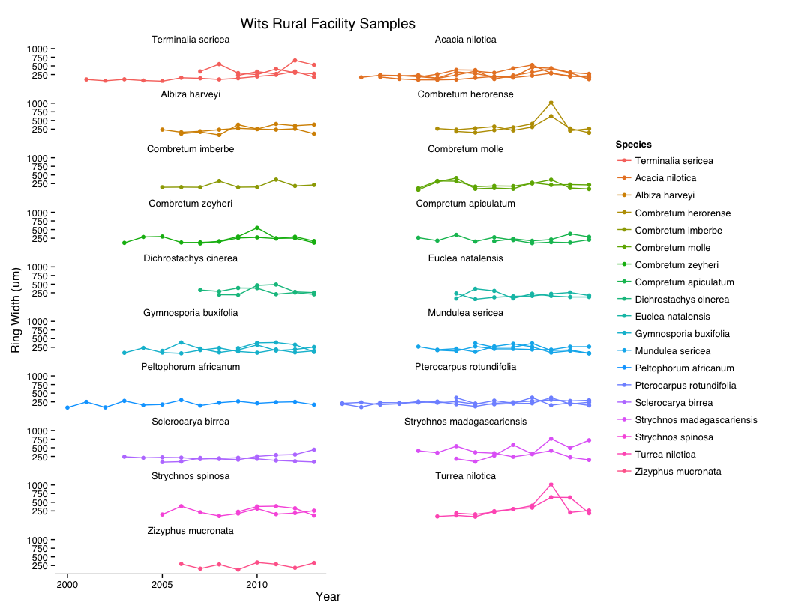
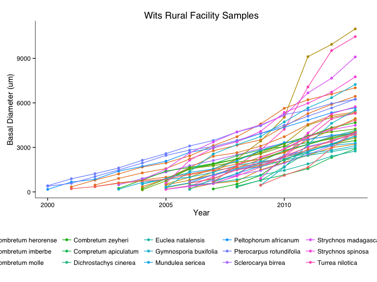
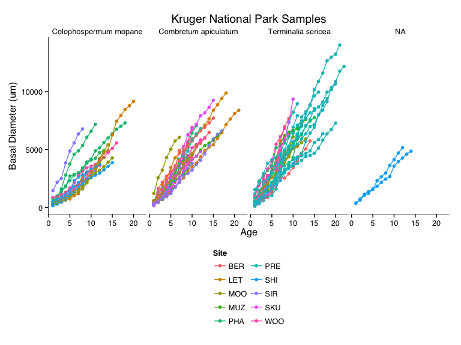
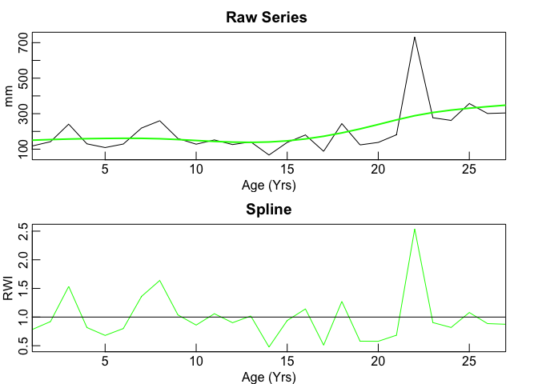

# Preliminary analysis of Tree Growth Data

Load appropriate libraries.

```r
library(plyr)
library(ggplot2)
library(reshape2)
library(stargazer)
library(dplR)
library(ggthemes)
#library(Hmisc)
library(gridExtra)
library(lme4)
library(extrafont)
```
Set working directory and establish standards for displaying figures.

```r
#setwd("/Users/danielgodwin/Dropbox/Graduate School/Dissertation/Chapter 3 - Growth/TreeRings/")

myTheme <- theme_tufte() +
  theme(
    text = element_text(family="sans", size=12),
        axis.line = element_line(size = .3)
    )

BasalDiameter_lab <- expression(paste("Basal Diameter (",
  u, m,")", sep=""))

RingWidth_lab <- expression(paste("Ring Width (",u, m,")", sep=""))

detrendedBasalDiameter_lab <- expression(paste("Detrended Basal Diameter (",
  u, m,")", sep=""))

detrendedRingWidth_lab <- expression(paste("Detrended Ring Width (",u, m,")", sep=""))
```
Read in data.

```r
Melon_Sites <- read.csv("Sites/Mellon_Tree.csv")
Melon_Species <- read.csv("MeasuredGrowth/MellonGrant/MellonGrant_Species.csv")
Melon_Growth <- read.csv("MeasuredGrowth/MellonGrant/MellonGrant_TreeGrowth_LongForm.csv")
Melon_Growth <- subset(Melon_Growth,SAMPLE != "M26")

source("WeatherProcessor.R")
PRET2011_RINGW_LongForm <- read.csv("MeasuredGrowth/TrialProject/PRET2011_RINGW_LongForm.csv")

names(PRET2011_RINGW_LongForm) <- c("Sample","Year","RingWidth")

WRF_Rings <- read.csv("MeasuredGrowth/MellonGrant/WRF_TreeGrowth_LongForm.csv"
                      ,comment.char = "#",
                      skip = 1)
WRF_Rings$Year <- WRF_Rings$Year + 113
names(WRF_Rings)[1] <- "Sample"
names(WRF_Rings)[3] <- "RingWidth"
WRF_Rings$Site <- "WRF"

WRF_Species <- read.csv("MeasuredGrowth/MellonGrant/WRF_Species.csv",comment.char = "#",
                      skip = 1)


names(Melon_Sites)[2] <- "Sample"
names(Melon_Species) <- c("Sample","Species")

Melon_Master <- merge(Melon_Sites,Melon_Species, by="Sample",all.x = TRUE)
Melon_Master$Species.x <- NULL
names(Melon_Master)[5] <- "Species"

WRF_Rings <- merge(WRF_Rings,WRF_Species,by="Sample")
#WRF_Rings$Species.x <- NULL
#names(Melon_Master)[5] <- "Species"
WRF_Rings <- na.omit(WRF_Rings)

names(Melon_Growth) <- c("Sample","Year","RingWidth")

Melon_Master <- merge(Melon_Master,Melon_Growth,by="Sample")
Melon_Master$Diam <- NULL
Melon_Master$TTT <- NULL

PRET2011_RINGW_LongForm$Site <- "PRE"
PRET2011_RINGW_LongForm$Species <-"Terminalia sericea"

Rings_Master <- rbind(Melon_Master,PRET2011_RINGW_LongForm)

Rings_Master <- rbind(Rings_Master,WRF_Rings)

#Rings_Master$RingWidth <- Rings_Master$RingWidth/1000

Rings_Master <- Rings_Master[order(Rings_Master$Sample,Rings_Master$Year),]

Rings_Master <- ddply(Rings_Master,.(Sample),mutate,Growth = cumsum(RingWidth))

Rings_Master$EstCrossSection <- (Rings_Master$Growth)^2 * pi
Rings_Master$EstBasalDiameter <- (Rings_Master$Growth) * 2

Rings_Master <- ddply(Rings_Master,.(Sample),mutate,YearOfGrowth = Year - min(Year)+1)

Rings_Master_AllWx <- merge(Rings_Master,Kruger_Wx_Combined,by.x=c("Year","Site"),by.y=c("Year","Station"))

#MAP <- read.csv("Weather/Kruger_MAP.csv")
#Rings_Master_AllWx <- merge(Melon_AllWx,MAP,by.x="Site",by.y="Station")

Rings_Kruger <- subset(Rings_Master,Site != "WRF")
Rings_WRF <- subset(Rings_Master,Site == "WRF")
```

### Plot of Ring Width by Site

  

### Plot of Basal Diameter by Year

  

### Plot of Basal Diameter by Year of Growth

  

Detrending
========
* Fit linear model to each site, species
* Subtract predicted values from each object.


```
## [1] "Terminalia sericea" "PRE"
```

 

```
## [1] "Terminalia sericea" "PHA"
```

 

```
## [1] "Terminalia sericea" "MOO"
```

 

```
## [1] "Terminalia sericea" "SHI"
```

 

```
## [1] "Terminalia sericea" "WRF"
```

 

```
## [1] "Terminalia sericea" "WOO"
```

 

```
## [1] "Combretum apiculatum" "LET"
```

 

```
## [1] "Combretum apiculatum" "SIR"
```

 

```
## [1] "Combretum apiculatum" "WOO"
```

 

```
## [1] "Combretum apiculatum" "PRE"
```

 

```
## [1] "Combretum apiculatum" "MOO"
```

 

```
## [1] "Combretum apiculatum" "PHA"
```

 

```
## [1] "Colophospermum mopane" "LET"
```

 

```
## [1] "Colophospermum mopane" "PHA"
```

 

```
## [1] "Colophospermum mopane" "WOO"
```

 

```
## [1] "Colophospermum mopane" "MOO"
```

 

```
## [1] "Colophospermum mopane" "SHI"
```

 

```
## [1] "Colophospermum mopane" "SIR"
```

 

```
## [1] "Pterocarpus rotundifolia" "WRF"
```

 

```
## [1] "Peltophorum africanum" "WRF"
```

 

```
## [1] "Acacia nilotica" "WRF"
```

 

```
## [1] "Combretum zeyheri" "WRF"
```

 

```
## [1] "Gymnosporia buxifolia" "WRF"
```

 

```
## [1] "Sclerocarya birrea" "WRF"
```

 

```
## [1] "Compretum apiculatum" "WRF"
```

 

```
## [1] "Combretum molle" "WRF"
```

 

```
## [1] "Mundulea sericea" "WRF"
```

 

```
## [1] "Strychnos madagascariensis" "WRF"
```

 

```
## [1] "Combretum imberbe" "WRF"
```

 

```
## [1] "Albiza harveyi" "WRF"
```

 

```
## [1] "Combretum herorense" "WRF"
```

 

```
## [1] "Strychnos spinosa" "WRF"
```

 

```
## [1] "Turrea nilotica" "WRF"
```

 

```
## [1] "Euclea natalensis" "WRF"
```

 

```
## [1] "Zizyphus mucronata" "WRF"
```

 

```
## [1] "Dichrostachys cinerea" "WRF"
```

 


```r
for(k in unique(detrendedDF$Species))
{
  SpeciesSubset <- subset(detrendedDF,Species == k)
  
  if(length(unique(as.character(SpeciesSubset$Sample))) > 2){
  for(l in unique(SpeciesSubset$Site)){
    SiteSubset <- subset(SpeciesSubset,Site == l)
    
    colsKeep <- c("Site","Year","Sample","Species","DetrendedRW","YearOfGrowth","AnnualPrecip")
    SiteSubset <- SiteSubset[colsKeep]

melted1 <- melt(SiteSubset,id.vars=c("Year","Sample"),measure.vars="DetrendedRW",value.name="DetrendedRW")

castDF <- dcast(melted1,Year ~ Sample,mean)

castDF[mapply(is.nan, castDF)] <- NA

SpeciesSite.crn <- chron(castDF)
}
}
}
```

### Detrended Growth by Species and Site


 


  


```r
detrended_Spec_KNP <- subset(detrendedDF_Kruger,Species == "Combretum apiculatum")

COAP_big <- ggplot(data = detrended_Spec_KNP, aes(x = Year, y= DetrendedRW, factor=Sample, colour = Sample))
 COAP_big+
   theme_bw()+
  theme(text = element_text(size = 25),
  #      panel.grid.major = element_line(size = 1, colour = "grey75"),
   #     panel.grid.minor = element_line(size = 1, colour = "grey25"),
        legend.position="none",
        legend.direction="vertical")+
   ylab("Ring Width Index")+
 # xlab("Cumulative Rainfall To Date (mm)")+
   geom_point(size = 4)+
   geom_line(size = 2)+
  scale_colour_discrete()+
  ggtitle(expression(paste("Kruger National Park Samples - ",italic("Compretum apiculatum"))))+
  guides(col = guide_legend(ncol = 8,title.position = "top"))+
   facet_wrap(~Site, ncol=2)
```

 


### Relationship Between Annual Rainfall and Detrended Growth

  

```
## [1] "Colophospermum mopane"
## Linear mixed model fit by REML ['lmerMod']
## Formula: DetrendedRW ~ log(AnnualPrecip) + 1 | Site
##    Data: m
## 
## REML criterion at convergence: 236.1
## 
## Scaled residuals: 
##    Min     1Q Median     3Q    Max 
## -1.609 -0.721 -0.141  0.455  3.402 
## 
## Random effects:
##  Groups   Name              Variance Std.Dev. Corr 
##  Site     (Intercept)       6.52e-11 8.08e-06      
##           log(AnnualPrecip) 1.74e-12 1.32e-06 -1.00
##  Residual                   2.50e-01 5.00e-01      
## Number of obs: 160, groups:  Site, 6
## 
## Fixed effects:
##             Estimate Std. Error t value
## (Intercept)   0.9878     0.0396      25
## Data: m
## Models:
## KNP_null: DetrendedRW ~ 1 + 1 | Site
## KNP: DetrendedRW ~ log(AnnualPrecip) + 1 | Site
##          Df AIC BIC logLik deviance Chisq Chi Df Pr(>Chisq)
## KNP_null  3 238 247   -116      232                        
## KNP       5 242 257   -116      232     0      2          1
## [1] "Combretum apiculatum"
## Linear mixed model fit by REML ['lmerMod']
## Formula: DetrendedRW ~ log(AnnualPrecip) + 1 | Site
##    Data: m
## 
## REML criterion at convergence: 127
## 
## Scaled residuals: 
##    Min     1Q Median     3Q    Max 
## -1.765 -0.786 -0.122  0.688  2.824 
## 
## Random effects:
##  Groups   Name              Variance Std.Dev. Corr 
##  Site     (Intercept)       6.98e-08 2.64e-04      
##           log(AnnualPrecip) 1.86e-09 4.31e-05 -1.00
##  Residual                   1.59e-01 3.99e-01      
## Number of obs: 123, groups:  Site, 6
## 
## Fixed effects:
##             Estimate Std. Error t value
## (Intercept)    0.988      0.036    27.5
## Data: m
## Models:
## KNP_null: DetrendedRW ~ 1 + 1 | Site
## KNP: DetrendedRW ~ log(AnnualPrecip) + 1 | Site
##          Df AIC BIC logLik deviance Chisq Chi Df Pr(>Chisq)
## KNP_null  3 128 137  -61.1      122                        
## KNP       5 132 146  -61.1      122     0      2          1
## [1] "Terminalia sericea"
## Linear mixed model fit by REML ['lmerMod']
## Formula: DetrendedRW ~ log(AnnualPrecip) + 1 | Site
##    Data: m
## 
## REML criterion at convergence: 407.8
## 
## Scaled residuals: 
##    Min     1Q Median     3Q    Max 
## -1.621 -0.718 -0.215  0.506  3.362 
## 
## Random effects:
##  Groups   Name              Variance Std.Dev. Corr 
##  Site     (Intercept)       0.6185   0.786         
##           log(AnnualPrecip) 0.0153   0.124    -1.00
##  Residual                   0.3106   0.557         
## Number of obs: 241, groups:  Site, 5
## 
## Fixed effects:
##             Estimate Std. Error t value
## (Intercept)   1.0068     0.0374    26.9
## Data: m
## Models:
## KNP_null: DetrendedRW ~ 1 + 1 | Site
## KNP: DetrendedRW ~ log(AnnualPrecip) + 1 | Site
##          Df AIC BIC logLik deviance Chisq Chi Df Pr(>Chisq)
## KNP_null  3 410 421   -202      404                        
## KNP       5 413 430   -202      403  1.27      2       0.53
```

### Relationship Between Annual Rainfall and Detrended Basal Diameter

  

  


### Potential relatiosnhips between avg. rainfall and avg RWI


```r
wellAligned <- data.frame(Species = "Pseudolignum sensitivum", meanLifeRainfall = c(400,450,475,500,525,550,565), avgWRI = c(.5,.75,.8,1,1.7,1.8,2))

reverseAligned <- data.frame(Species = "Pseudolignum contrasensitivum", meanLifeRainfall = c(400,450,475,500,525,550,565), avgWRI = c(2.1,1.6,1.1,1,.5,.3,.1))

nonAligned <- data.frame(Species = "Pseudolignum remissum", meanLifeRainfall = c(400,450,475,500,525,550,565), avgWRI = rnorm(n = 7, mean = 1, sd = .5))

fakeDF <- rbind(wellAligned,reverseAligned)
fakeDF <- rbind(fakeDF,nonAligned)

RWI_wx_h0_big <- ggplot(data = fakeDF, aes(x = log(meanLifeRainfall), y= log(avgWRI), group = Species, factor=Species, colour = Species))
RWI_wx_h0_big+
   theme_bw()+
  theme(text = element_text(size = 25),
  #      panel.grid.major = element_line(size = 1, colour = "grey75"),
   #     panel.grid.minor = element_line(size = 1, colour = "grey25"),
        legend.position="none",
        legend.direction="vertical")+
    ylab("log Average Ring Width Index")+
   ggtitle("")+
  xlab("log Mean Lifetime Rainfall (mm)")+
   geom_point(size = 4)+
  scale_colour_discrete()+
 # geom_smooth(method="nls")+
  guides(col = guide_legend(ncol = 8,title.position = "top"))+
   facet_wrap(~Species, ncol=3)
```

 

### Recorded relationships between average RWI and mean rainfall


```r
RWI_wx_big <- ggplot(data = detrendedDF_summary_KNP, aes(x = log(meanLifeRainfall), y= log(avgWRI), group = Species, factor=Species, colour = Species))
 RWI_wx_big+
   theme_bw()+
  theme(text = element_text(size = 25),
  #      panel.grid.major = element_line(size = 1, colour = "grey75"),
   #     panel.grid.minor = element_line(size = 1, colour = "grey25"),
        legend.position="none",
        legend.direction="vertical")+
    ylab("log Average Ring Width Index")+
   ggtitle("Kruger National Park Samples")+
  xlab("log Mean Lifetime Rainfall (mm)")+
   geom_point(size = 4)+
  scale_colour_discrete()+
 # geom_smooth(method="nls")+
  guides(col = guide_legend(ncol = 8,title.position = "top"))+
   facet_wrap(~Species, ncol=3)
```

 

```r
lm_sub_COMO <- subset(detrendedDF_summary_KNP,Species == "Colophospermum mopane")
summary(lm(data=lm_sub_COMO,log(avgWRI) ~ log(meanLifeRainfall)))
```

```
## 
## Call:
## lm(formula = log(avgWRI) ~ log(meanLifeRainfall), data = lm_sub_COMO)
## 
## Residuals:
##     Min      1Q  Median      3Q     Max 
## -0.5496 -0.0682  0.0120  0.1923  0.4134 
## 
## Coefficients:
##                       Estimate Std. Error t value Pr(>|t|)
## (Intercept)              3.964      2.383    1.66     0.12
## log(meanLifeRainfall)   -0.645      0.386   -1.67     0.12
## 
## Residual standard error: 0.247 on 14 degrees of freedom
## Multiple R-squared:  0.166,	Adjusted R-squared:  0.107 
## F-statistic: 2.79 on 1 and 14 DF,  p-value: 0.117
```

```r
lm_sub_COAP <- subset(detrendedDF_summary_KNP,Species == "Combretum apiculatum")
summary(lm(data=lm_sub_COAP,log(avgWRI) ~ log(meanLifeRainfall)))
```

```
## 
## Call:
## lm(formula = log(avgWRI) ~ log(meanLifeRainfall), data = lm_sub_COAP)
## 
## Residuals:
##     Min      1Q  Median      3Q     Max 
## -0.1962 -0.0935 -0.0289  0.0586  0.4961 
## 
## Coefficients:
##                       Estimate Std. Error t value Pr(>|t|)
## (Intercept)             -0.850      1.364   -0.62     0.54
## log(meanLifeRainfall)    0.134      0.221    0.61     0.55
## 
## Residual standard error: 0.182 on 12 degrees of freedom
## Multiple R-squared:  0.0298,	Adjusted R-squared:  -0.051 
## F-statistic: 0.369 on 1 and 12 DF,  p-value: 0.555
```

```r
lm_sub_TESE <- subset(detrendedDF_summary_KNP,Species == "Terminalia sericea")
summary(lm(data=lm_sub_TESE,log(avgWRI) ~ log(meanLifeRainfall)))
```

```
## 
## Call:
## lm(formula = log(avgWRI) ~ log(meanLifeRainfall), data = lm_sub_TESE)
## 
## Residuals:
##     Min      1Q  Median      3Q     Max 
## -0.4140 -0.0577  0.0262  0.0932  0.2789 
## 
## Coefficients:
##                       Estimate Std. Error t value Pr(>|t|)
## (Intercept)             0.4476     1.1619    0.39     0.70
## log(meanLifeRainfall)  -0.0731     0.1804   -0.41     0.69
## 
## Residual standard error: 0.194 on 19 degrees of freedom
## Multiple R-squared:  0.00858,	Adjusted R-squared:  -0.0436 
## F-statistic: 0.164 on 1 and 19 DF,  p-value: 0.69
```
### Correlations


Naive Growth

```r
naive_growth <- ddply(Rings_Master_AllWx,
                      .(Species,Site,Sample),
                      summarise,
                      TotalSize = sum(EstBasalDiameter),
                      Age = max(YearOfGrowth),
                      meanLifeRainfall = mean(AnnualPrecip,na.rm=TRUE),
                      sumLifeRainfall = sum(AnnualPrecip,na.rm=TRUE)
                      )

naive_growth$NaiveRate <- log(naive_growth$TotalSize)/naive_growth$Age
```

 

```
## [1] "Colophospermum mopane"
## 
## Call:
## lm(formula = NaiveRate ~ meanLifeRainfall, data = subSpec)
## 
## Residuals:
##     Min      1Q  Median      3Q     Max 
## -0.4483 -0.1684  0.0155  0.0856  0.3930 
## 
## Coefficients:
##                   Estimate Std. Error t value Pr(>|t|)    
## (Intercept)       2.574822   0.373821    6.89  7.5e-06 ***
## meanLifeRainfall -0.003198   0.000763   -4.19    9e-04 ***
## ---
## Signif. codes:  0 '***' 0.001 '**' 0.01 '*' 0.05 '.' 0.1 ' ' 1
## 
## Residual standard error: 0.225 on 14 degrees of freedom
## Multiple R-squared:  0.557,	Adjusted R-squared:  0.525 
## F-statistic: 17.6 on 1 and 14 DF,  p-value: 0.000903
## 
## [1] "Combretum apiculatum"
## 
## Call:
## lm(formula = NaiveRate ~ meanLifeRainfall, data = subSpec)
## 
## Residuals:
##     Min      1Q  Median      3Q     Max 
## -0.5599 -0.1369  0.0258  0.2137  0.4581 
## 
## Coefficients:
##                   Estimate Std. Error t value Pr(>|t|)    
## (Intercept)       1.697089   0.350384    4.84   0.0004 ***
## meanLifeRainfall -0.001147   0.000691   -1.66   0.1227    
## ---
## Signif. codes:  0 '***' 0.001 '**' 0.01 '*' 0.05 '.' 0.1 ' ' 1
## 
## Residual standard error: 0.296 on 12 degrees of freedom
## Multiple R-squared:  0.187,	Adjusted R-squared:  0.119 
## F-statistic: 2.76 on 1 and 12 DF,  p-value: 0.123
## 
## [1] "Terminalia sericea"
## 
## Call:
## lm(formula = NaiveRate ~ meanLifeRainfall, data = subSpec)
## 
## Residuals:
##    Min     1Q Median     3Q    Max 
## -0.404 -0.279 -0.151  0.132  0.879 
## 
## Coefficients:
##                   Estimate Std. Error t value Pr(>|t|)    
## (Intercept)       1.780229   0.397765    4.48  0.00019 ***
## meanLifeRainfall -0.001129   0.000603   -1.87  0.07448 .  
## ---
## Signif. codes:  0 '***' 0.001 '**' 0.01 '*' 0.05 '.' 0.1 ' ' 1
## 
## Residual standard error: 0.386 on 22 degrees of freedom
## Multiple R-squared:  0.137,	Adjusted R-squared:  0.0983 
## F-statistic: 3.51 on 1 and 22 DF,  p-value: 0.0745
## 
## [1] "Acacia nilotica"
## 
## Call:
## lm(formula = NaiveRate ~ meanLifeRainfall, data = subSpec)
## 
## Residuals:
##       55       56       57       58 
## -0.00588 -0.03168  0.03532  0.00224 
## 
## Coefficients:
##                   Estimate Std. Error t value Pr(>|t|)  
## (Intercept)      -1.216863   0.456191   -2.67    0.116  
## meanLifeRainfall  0.003242   0.000701    4.63    0.044 *
## ---
## Signif. codes:  0 '***' 0.001 '**' 0.01 '*' 0.05 '.' 0.1 ' ' 1
## 
## Residual standard error: 0.0338 on 2 degrees of freedom
## Multiple R-squared:  0.915,	Adjusted R-squared:  0.872 
## F-statistic: 21.4 on 1 and 2 DF,  p-value: 0.0437
```


Growth Models
========
First, we subset the data.

```r
COMO_sub <- subset(Rings_Master_AllWx,Species == "Colophospermum mopane")
COAP_sub <- subset(Rings_Master_AllWx,Species == "Combretum apiculatum")
TESE_sub <- subset(Rings_Master_AllWx,Species == "Terminalia sericea")
```
TESE Models

COAP Models

COMO Models


